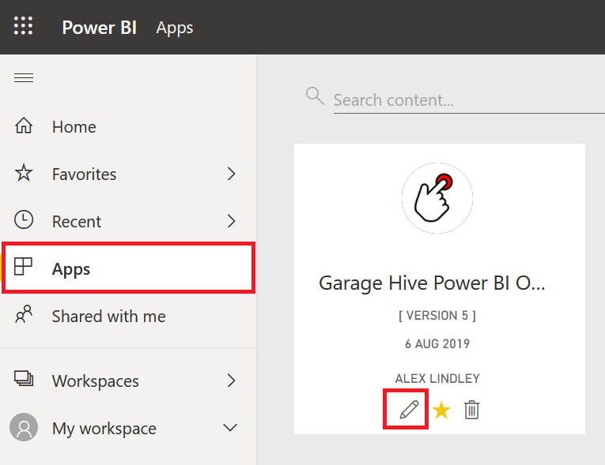
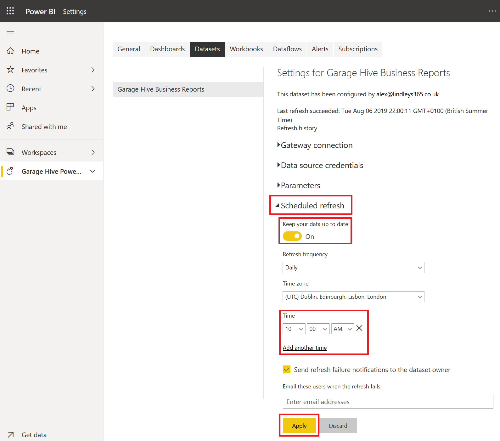

#   How to to refresh your data

## How to schedule a refresh



To schedule refresh times, please select your app and then select edit. 

Select "Datasets", then select "Schedule Refresh"

Now select "Scheduled Refresh"

Enable "Keep your data up to date"

You can also add additional refresh times if you wish, you can setup up to 8 refresh times. 

You must press Apply once you have compelted your setup. 

## How to force a refresh.

Outside of the scheduled refresh, you can force a refresh at any time. please select your app and then select edit. 

Select "Force Refresh", the refresh can take up to 15 minutes. 

