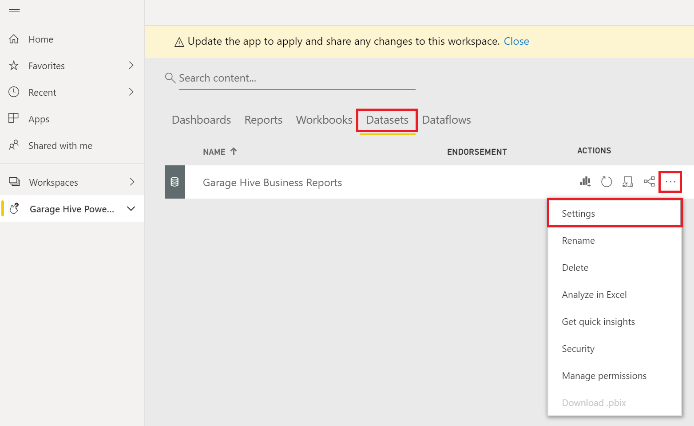
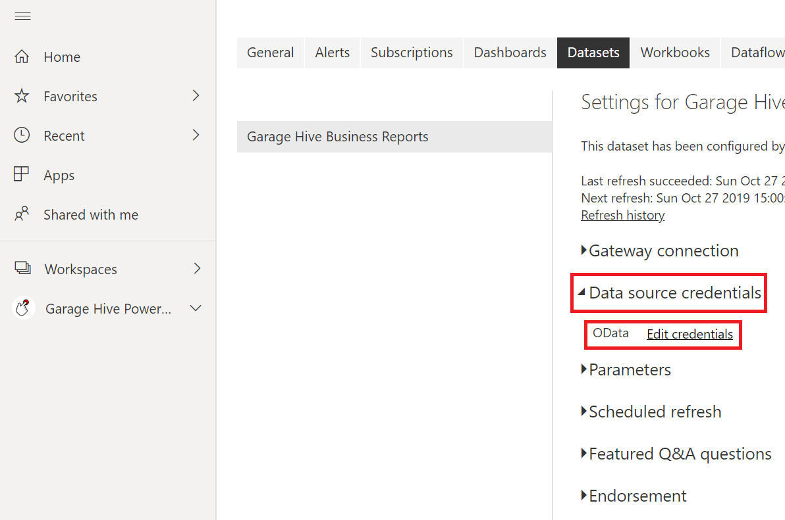
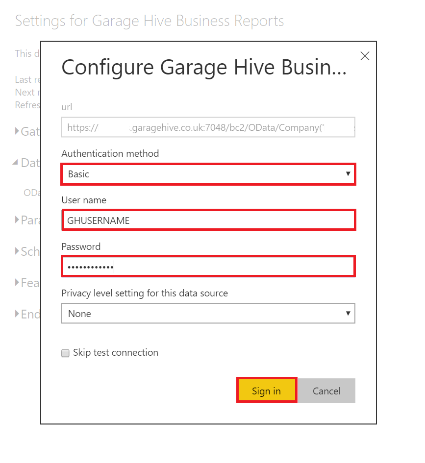

# How to to update your Garage Hive Credentials in Power BI



# Updating your Credentials

Sometimes you will need to update your Garage Hive credentials within Power BI, this allows Power BI to access your system to collect the necessary data to produce the reports. To do this:
1. From within **Power BI**, select **Apps**, then select **Edit**. 

   

2. Select **Datasets**, then select the 3 dots (...), then select **Settings**.

   

3. Now, select the drop down **Data Source Credentials** then select **Edit credentials**.

   

4. In **Garage Hive** search for **Power BI App Setup**...

   
   
5. Select the Authentication method as **Basic**, enter your **Username** and **Password** (use the **Web Service Access Key** - click on the three dots to view) from your **Power BI App Setup**., then press **Sign In**.

   > **NOTE:** We recommend using the **Web Service Access Key** since it's independent of the **Garage Hive** system password. This means, if your **Garage Hive** system is reset, your **Power BI App** will continue working as usual without crashing.

   

6. Your credentials have now been updated, you might need to re-enable your scheduled refresh. Learn more here - [How to refresh your data](https://docs.garagehive.co.uk/docs/powerbi-refresh-data.html "How to refresh your data")

