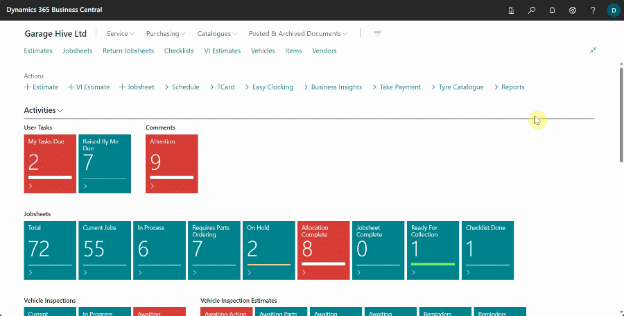

# Updating Your Garage Hive's Power BI App Credentials
Sometimes you will need to update your Garage Hive credentials within Power BI, this allows Power BI to access your system to collect the necessary data to produce the reports. To do this:
1. From within **Power BI App**, select **Apps** from the side tabs, click on the three dots at the bottom-right and then select **Edit**. 

   

2. Select **Datasets + dataflows** at the top of the page, then hover the mouse on the **Garage Hive Power BI App** and the select the verstical 3 dots, and then select **Settings**.

   

3. Scroll down to **Data Source Credentials** menu and click on it, and then select **Edit credentials**.

   

4. In **Garage Hive** search for **Power BI App Setup**, and use the details on this page to update your **Power BI App**.

   

5. Select the Authentication method as **Basic**, enter your **Username** and **Password** (use the **Web Service Access Key** - click on the ellipsis (...) to view key) from your **Power BI App Setup**., then press **Sign In**.

   > **NOTE:** We recommend using the **Web Service Access Key** since it's independent of the **Garage Hive** system password. This means, if your **Garage Hive** system is reset, your **Power BI App** will continue working as usual without crashing.

   

6. Your credentials have now been updated, you might need to re-enable your scheduled refresh. Learn more here - [How to refresh your data](https://docs.garagehive.co.uk/docs/powerbi-refresh-data.html "How to refresh your data"){:target="_blank"}

 

### **See Also**
[Video - How to update your Garage Hive's Power BI App credentials](https://youtu.be/dcvhako90OE){:target="_blank"} \
[How to set your Average Labour Rate](garagehive-labour-rate.html){:target="_blank"} \
[Installing the Power BI App](powerbi-installing-app.html){:target="_blank"} \
[Refreshing your Power BI data](powerbi-refresh-data.html){:target="_blank"} \
[Updating your Power BI App](powerbi-updating-app.html){:target="_blank"} \
[Deleting the Power BI and installing a new one](garagehive-delete-old-powerbi-app-and-install-new-one.html){:target="_blank"} \
[How to Set Business Targets](garagehive-how-to-set-business-targets.html){:target="_blank"}

