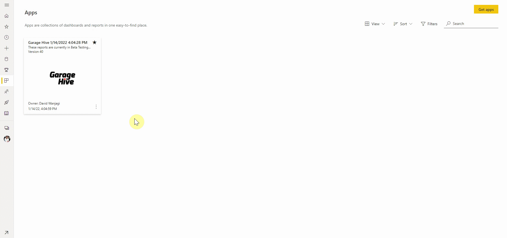

# Updating the Power BI App

Periodically you will need to update your Garage Hive Power BI App. 

To do this:
1. Login to your **Garage Hive Power BI App** account and click on the link below.

   > # Power BI installation link: <ins>[Garage Hive Power BI App - V59 Download](https://app.powerbi.com/Redirect?action=InstallApp&appId=739eb02b-643e-4bc3-a9ae-61191a89452d&packageKey=73750ca0-52fb-4db8-8fa7-ef5f61e392fdL0ZFggHiQecl0eblitlIqTDEo2P7-Ie6bb7CWfsuW8A&ownerId=1bde89ad-b4ce-45df-a919-e1e08e47294d&buildVersion=59 "Power BI V59 Download"){:target="_blank"}</ins>
 
2. Select **Install**, then **Update the workspace and the app**. It will take a few moments for the app to **Update**.
   
   

3. Once updated, click the three dots in the bottom-right corner of the app and select **Edit**. 
4. To refresh the data in the App, hover over the **Garage Hive Power BI APP** on the page that opens and select the **Refresh Now** button.

   

5. If you performed the update correctly, you will not need to re-authorize your App or change your refresh schedule.

* For more information on refreshing your data visit - [How to refresh your data](https://docs.garagehive.co.uk/docs/powerbi-refresh-data.html "How to refresh your data"){:target="_blank"}

 

### **See Also**
[Video - How to install the Garage Hive Power BI report](https://youtu.be/iO17qPjBAc0){:target="_blank"} \
[How to set your Average Labour Rate](garagehive-labour-rate.html){:target="_blank"} \
[Installing the Power BI App](powerbi-installing-app.html){:target="_blank"} \
[Refreshing your Power BI data](powerbi-refresh-data.html){:target="_blank"} \
[Updating your Power BI credentials](powerbi-updating-app.html){:target="_blank"} \
[Deleting the Power BI and installing a new one](garagehive-delete-old-powerbi-app-and-install-new-one.html){:target="_blank"} \
[How to Set Business Targets](garagehive-how-to-set-business-targets.html){:target="_blank"}