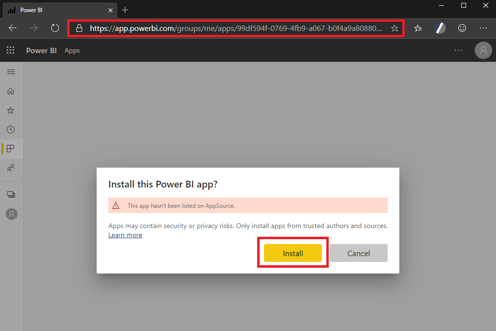
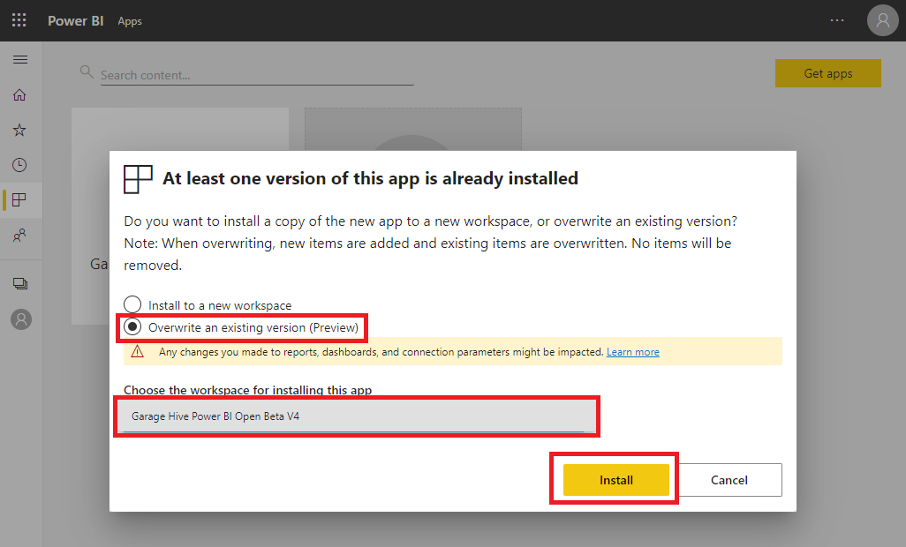
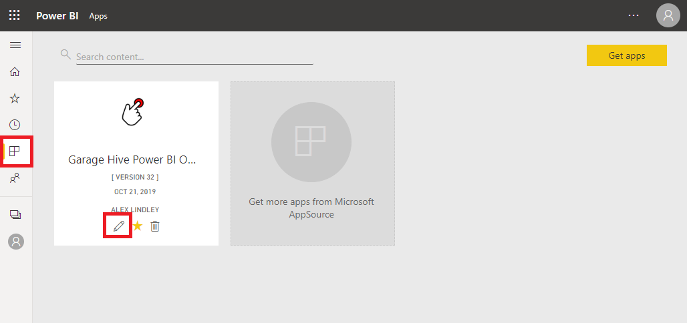
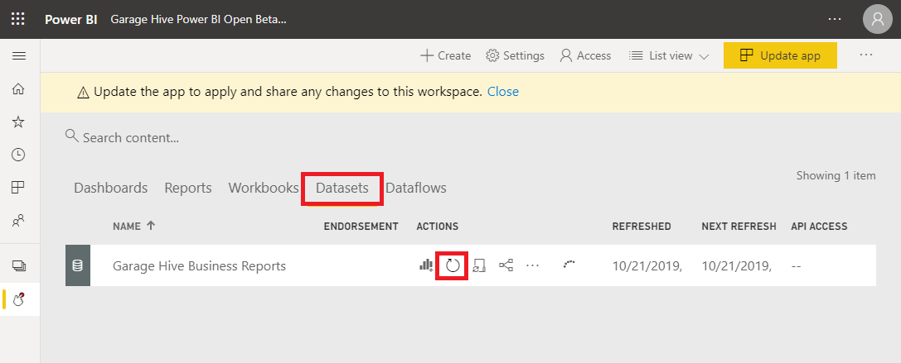

#   How to Update the Power BI App

Periodically you will need to update your Power BI Garage Hive App. 

To do this, login to your Garage Hive Power BI account and click on the link below.

# [Garage Hive Power BI App Version 20](https://app.powerbi.com/Redirect?action=InstallApp&appId=739eb02b-643e-4bc3-a9ae-61191a89452d&packageKey=d14ed8ad-ff80-4255-a467-af6df6f00f49FKINvwWskhP5QfduOI-514LNOFbL2o8YPmlWNQldkgc&ownerId=1bde89ad-b4ce-45df-a919-e1e08e47294d&buildVersion=20"Power BI Update URL"){:target="_blank"}
   

Select Install.

Select Overwrite an existing version and find the workspace you previously installed the App into. 

The app will take a few minutes to update. Once updated select the edit button. 

Select the refresh button to refresh the data in the App. 

If you have performed the update correctly, you won't need to re-authorise your App or update your refresh schedule. 

* For more information on refreshing your data visit - [How to refresh your data](https://docs.garagehive.co.uk/docs/powerbi-refresh-data.html "How to refresh your data")