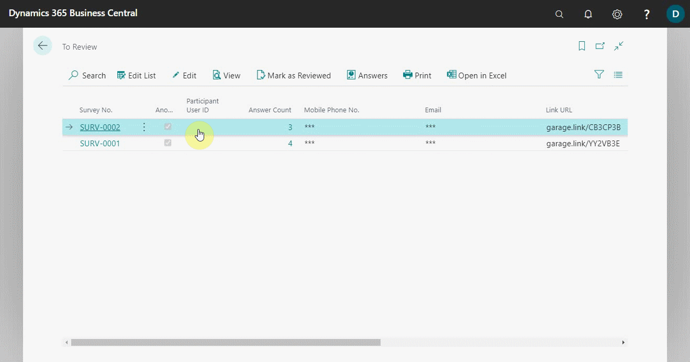

# Reviewing Internal Surveys

To review the internal surveys after the employees have completed and submitted them:
1. From the role centre, there are two sections of surveys tiles available: customer surveys and internal surveys, both with **To Review** and **This Week** tiles.
2. After the internal surveys are completed and submitted, the **To Review** tile under **Internal Surveys** is populated.
3. Click on the **To Review** tile to see a list of the surveys that have been submitted.

   

4. Click on the **Answer Count** column cell for each line of the survey in the list to view the responses. If you marked the survey as **Anonymous**, the **Mobile Phone No.** and **Email** columns will have asterisks only to hide the user's identity.
5. After reading the answers click on **Edit List** from the actions bar, and mark the surveys **Reviewed** under the reviewed column.

   

 

### **See Also**

[Setting up and sending internal surveys](garagehive-setting-up-and-sending-internal-surveys.html) \
[Scheduling recurring internal surveys](garagehive-scheduling-recurring-internal-surveys.html) \
[Exporting an internal survey](garagehive-exporting-an-internal-survey.html) \
[How to get started with external consultant survey](garagehive-how-to-get-started-with-external-consultant-survey.html) \
[Importing an internal survey](garagehive-importing-an-internal-survey.html)