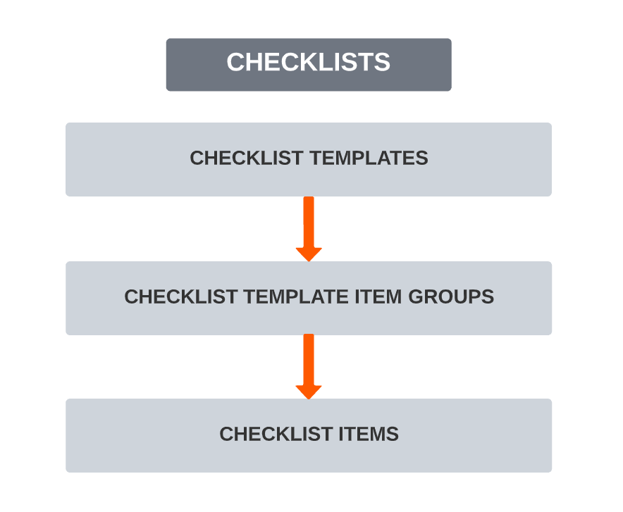
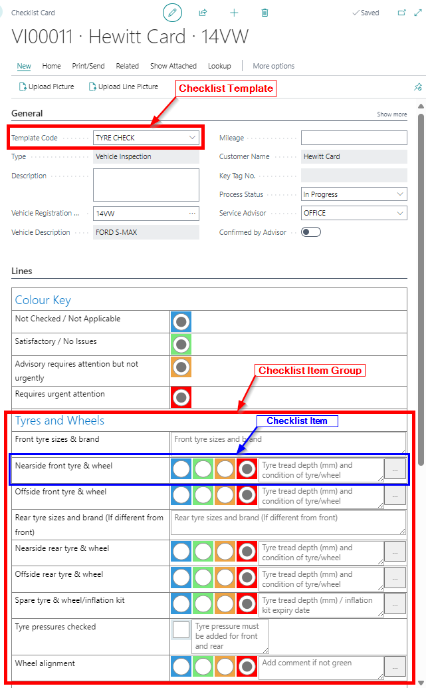
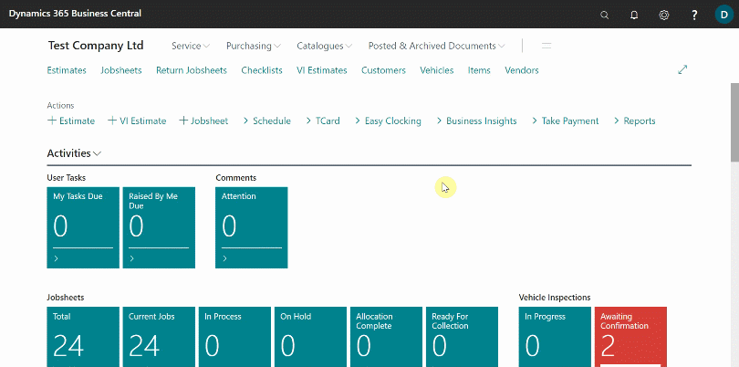
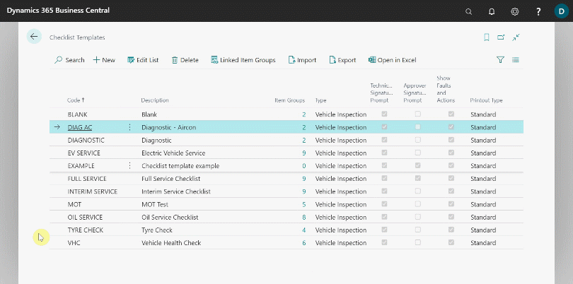
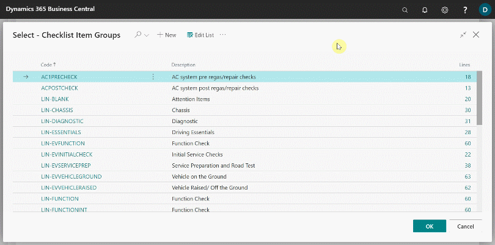
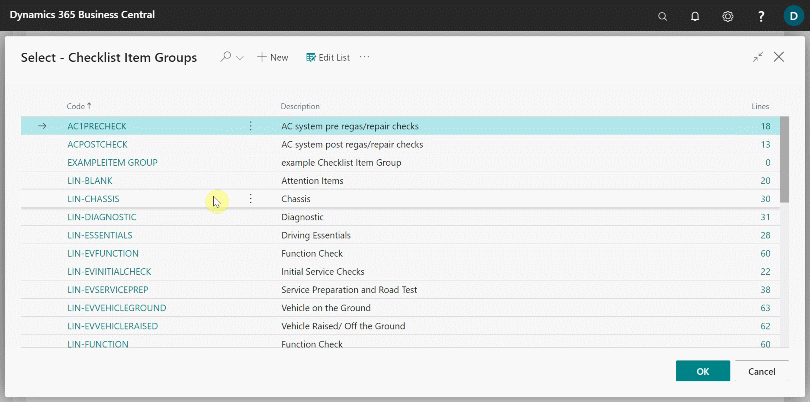
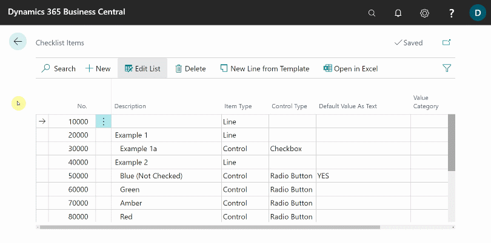

# How to Setup and Work With Checklists
Checklists allow you to create an inspection sheet/checklist for vehicle diagnosis, service, troubleshooting, and so on. A vehicle inspection is an example of a checklist. The following is the structure of a checklist:

   

Here's an example of how a checklist looks when it's fully set up:

   

## Checklist Templates
A Checklist Template is considered the header of the Checklist. To view and create new **Checklist Templates** in your system:
1. Enter **Checklist Templates** in the search icon and select the related link.
1. Select **New** from the actions bar, to create a new **Checklist Template**.
1. The following is what you can setup in the **Checklist Templates** page:
    * **Code** - To identify the template in the system.
    * **Description** - To describe the template.
    * **Type** - It can be either **Vehicle Inspection** or **Quality Control**.
    * **Tech Signature Prompt** checkbox - When enabled, it prompts the technician to to sign off the checklist when done.
    * **Approver Signature Prompt** checkbox - When enabled, it prompts the person confirming the checklist to sign off the checklist.
    * **Show Faults and Actions** checkbox - When enabled, it shows the **Faults and Actions** fasttab in the checklist.
    * **Printout Type** - It can be either **Standard** or **Two Columns**.

        

    > **Note:**
    >
    > Checklist Template will be the description of your checklist that you select from when deciding which checklist to complete as a technician.

1. Each Checklist Template must have at least one **Checklist Template Item Group**. 

## Checklist Template Item Groups
**Checklist Template Item Groups** are the groups of the list of questions in a checklist. They are grouped according to their purpose in a checklist, for example questions in a checklist concerning the tyres are grouped together, and so on.
1. To create a new **Checklist Template Item Group**, select the **Checklist Template** you have created, and choose **Linked Item Groups** from the actions bar.
1. From the **Checklist Template Item Groups** page, click on the **Group Code** column, and choose **Select from full list**.

   

1. From the **Select - Checklist Item Groups** page, select **New** from the actions bar, to create a new **Checklist Item Group**; add the **Code** and **Description** for the checklist item group.

   

      > **Note:**
      > 
      > **Checklist Template Item Groups** can be linked to multiple **Checklist Template**, for example a **Tyre Checkist Item Group** could belong in the **Full Service Checklist Template** and the **Interim Service Checklist Template**. 

## Checklist Items
**Checklist Items** are where you enter your checklist questions; a checklist item for example could be about tyres and could consist of a traffic light system and check boxes like the example below. 

   

1. To create new **Checklist Items** for the **Checklist Template Item Group** that you have created, select the three dots at the actions bar, and then **Items**.

   

2. The following is what needs to be setup in the **Checklist Items** page:
      * **No.** - Each line must have a number, this is the order in which the questions will appear. 
      * **Description** - The caption is what will appear on the line of the questions.
      * **Item Type** - Choose from either Line (a title) or Control (an entry).
      * **Control Type** - Select from what type of entry you want.
          * Radio Button
          * Textbox-Small
          * Textbox-Large
          * Checkbox
      * **Default Value** - You can populate a field with a default value to determine which radio button is pre-ticked.
      * **Attention If Has Value** Ticking this box will allow the Advisor to see from the list of checklists if any particular checklist requires attention. Any entry on a line with this ticked will flag a checklist.

3. To add **Checklist Items** lines, use the available template from the actions bar by selecting **New Line From Template**. This provides you with the following templates:
      * **Checkbox**
            
         

      * **Radio Buttons: B.G.A.R**

         

      * **Textbox**
            
         

      * **2xSmall Textboxes - Provides**
            
         

4. Add the templates according to the question or information required:

   

5. After adding the **Checklist Items** ensure you link it to the **Checklist Item Group**, by clicking  the **OK** button in the **Select - Checklist Item Groups** page.

   

6. The **Checklist Template** is now ready to use. Create a new **Checklist** and select the **Checklist Template** you have created as the **Template Code**.

   

 

### See also

[Video: How to create Checklist Templates in Garage Hive](https://www.youtube.com/watch?v=biWot0Z4r9w) \
[How to perform a Vehicle Inspection](https://docs.garagehive.co.uk/docs/garagehive-technicians-vehicle-inspections.html "How to perform a Vehicle Inspection") \
[How to use VHCs](https://docs.garagehive.co.uk/docs/garagehive-VHC.html "How to use VHCs")