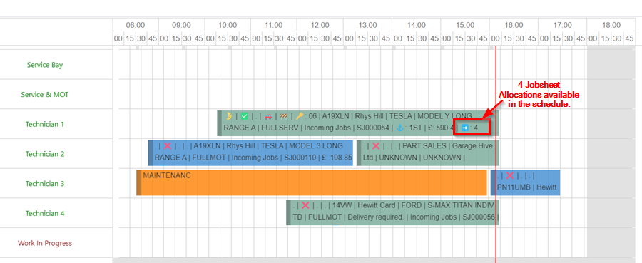
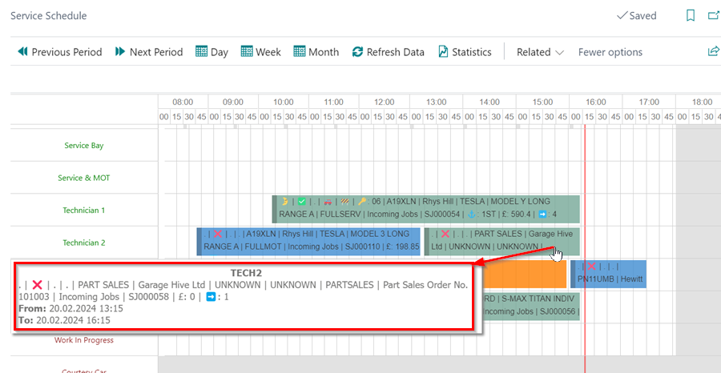

# We are still working on this article!
We are currently reviewing this article before it is published, check back later.

# How to Add Schedule Allocations Count in Garage Hive
The addition of allocations count improves the visibility of Jobsheet allocations within the schedule. Garage Hive uses an right arrow emoji (➡️) accompanied by a number to indicate the number of pending or in-progress allocations for each Jobsheet. This feature allows users to easily identify Jobsheets with multiple ongoing tasks, thereby enhancing workflow management. Here is how to add the allocations count:

1. In the top right corner, choose the  icon, enter **schedule cell config**, and select the related link.

   

2. Click on **New** to create a new line, and enter the following details on the new line for the columns indicated:
   * **Source Type** - 25006145
   * **Source Ref. No.** - 15020
   * **Source Ref. Description** - *This will be automatically filled.*
   * **Sequence** - 9999999
   * **Prefix** - ➡️ (Press [WIN] + [.] on your keyboard, and search for right arrow.)

     

3. Click the back arrow (&#8592;) to close the page.
4. When there is an allocation is added in the schedule, the emoji will appear on the allocation showing the number of Jobsheet allocations available in the schedule.

   

If the emoji is not visible, you can hover your mouse over the allocation to view more information about the allocation.

   

[Go back to top](#top)