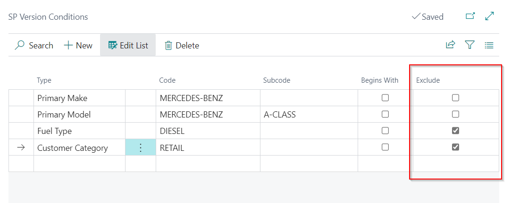
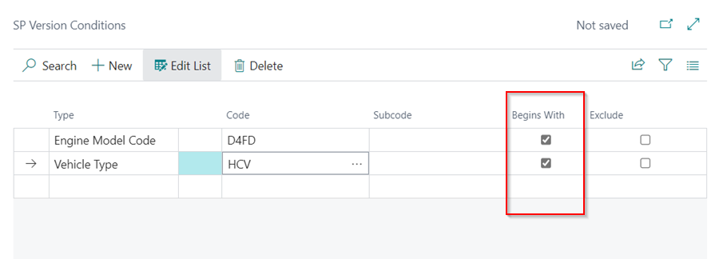
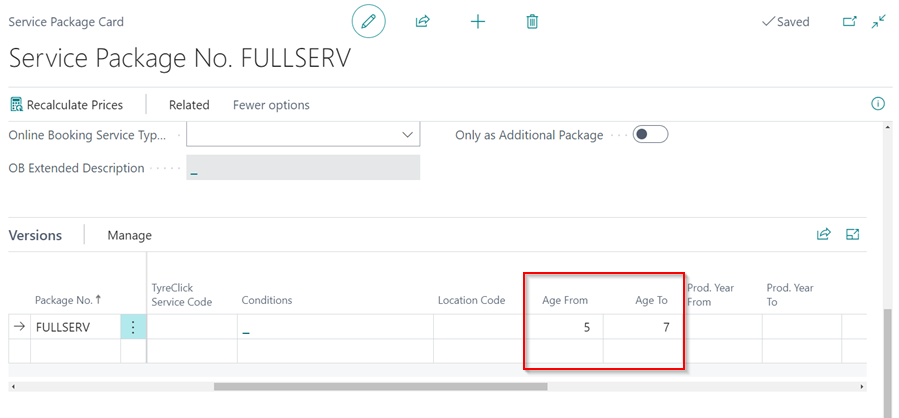
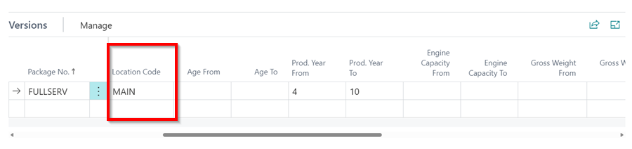
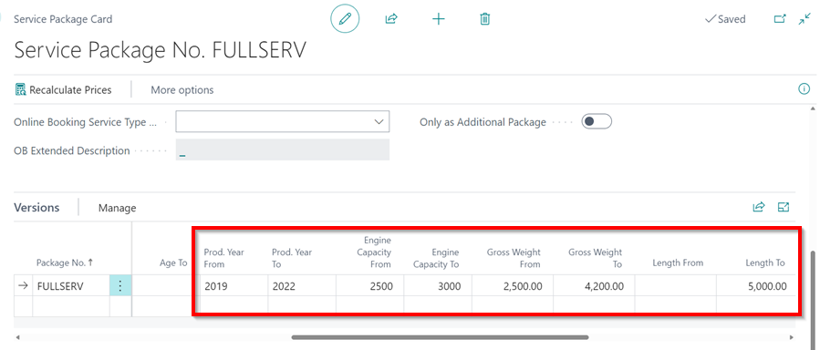

# How to set up service package conditions in Garage Hive
With service package conditions, you have the ability to filter service package versions based on a specific set of criteria. These filters can be applied to both system documents and online documents, provided that you have the online booking module.

1. [First Set of Filtering Criteria](#first-set-of-filtering-criteria)
   * Make
   * Model
   * Vehicle Type
   * Fuel Type
   * Customer Category
   * Transmission
   * Engine Model Code
   * Primary Make
   * Primary Model
2. [Second Set of Filtering Criteria](#second-set-of-filtering-criteria)
   * Vehicle's Age
   * Location
   * Production Year
   * Engine Capacity
   * Vehicle's Weight
   * Vehicle's Length

### First Set of Filtering Criteria
To set the conditions for a service package using the first set of criteria:
1. Select **Catalogues** from the navigation menu in the Role Centre and then **Service Packages**.

   

2. Choose the service package you want to give conditions and scroll down to the **Versions** sub-page. Click on **Manage** and select **Conditions**.

   

3. You can add various conditions to the **SP Version Conditions** page. In this case, we'll use **Primary Make**, **Primary Model**, **Fuel Type**, and **Customer Category**. Click on the first cell in the **Type** column and add these conditions.

   

4. Take note of the exclude check box on the right; sometimes, it's better to exclude an option rather than include all variants. A good example is excluding diesel, diesel/electric, and electric, which would result in a petrol version, as there are many more petrol and petrol/hybrids to list. 

   

5. It is also possible to add the **Begins With** checkbox filter to conditions such as **Engine Model Codes** and **Vehicle Type** to include all vehicles that begin with the specified **Code**. For example, if you enter **N47** as the Engine Model Code for BMW, all vehicles in that condition will be included, and so on.

   

### Second Set of Filtering Criteria
1. To set the **Vehicle's Age** condition, open the **Service Package Card** and scroll down to the version lines. Add the lower limit of the vehicle age in the **Age From** field, and the upper limit of the vehicle age in the **Age To** field for which you want the condition to apply.

   

2. The vehicle's age is important because it is based on the first registration date for when the vehicle was produced, rather than the production year, which can become less relevant over time. 
3. The **Location** condition can be set by entering the **Location Code** in the version lines.

   

4. The **Production Year**, **Engine Capacity**, **Vehicle Weight**, and **Vehicle Length** conditions can be set by entering the conditions' **Lower Limit** and/or **Upper Limit** in the fields available in the **Service Package Versions** lines.

   

 

### See Also

[Video: Service Package conditions](http://www.youtube.com/watch?v=DDrB5v6kzM0){:target="_blank"} \
[Setting up service packages](/docs/garagehive-service-packages.html) \
[Setting up service packages for online booking](/docs/garagehive-onlinebooking-service-packages.html) \
[Setting up primary makes and models](/docs/garagehive-setting-up-primary-makes-and-models.html) \
[Automatically adding Service Packages in documents](/docs/garagehive-automatically-adding-service-packages.html)