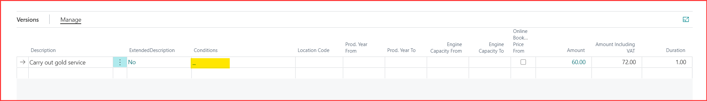
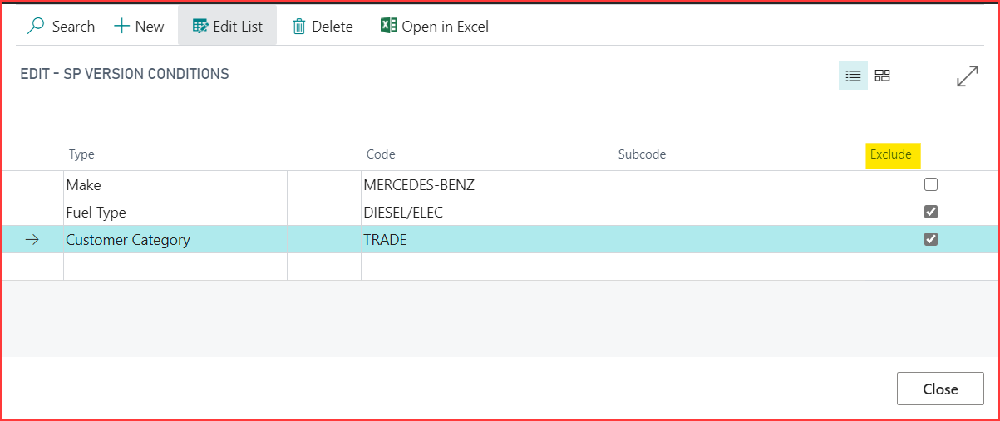
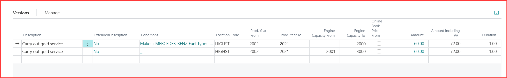

# How to set up service package conditions in Garage Hive.

Service package conditions allow you to filter package versions by a set of criteria, they are filtered in documents and online if you have the online booking module.

To watch the video guide for this document, please click here -> [**Service Package conditions Video**](http://www.youtube.com/watch?v=DDrB5v6kzM0){:target="_blank"}

Currently, you can set the following conditions for service package versions.

* Make
* Fuel Type
* Production Year Range
* Engine capacity Range
* Customer category 
* Business location (Multi Branch)

To set Make, Fuel and Customer Category conditions select the conditions column. 

Note the exclude check box to teh right, some times its better to exclude an option rather than include all variants. a good example is excluding diesel, diesel/elec and electric would create a petrol version as there are many more petrol, petrol/hybrids to list.  

Location, Production year ranges and engine capacity ranges are set from the version lines. 

 For information about setting up service packages [click here](/docs/garagehive-service-packages.html)

 For information about setting up service packages for online booking [click here](/docs/garagehive-onlinebooking-service-packages.html)