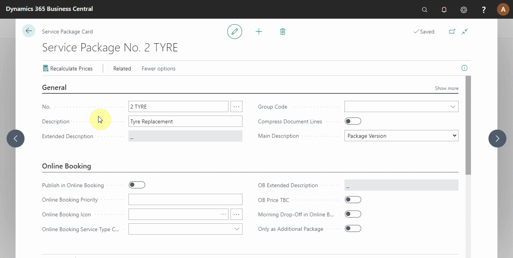

# How to set up service package conditions in Garage Hive

Service package conditions allow you to filter package versions by a set of criteria; they are filtered in documents and online if you have the online booking module.

#

Currently, you can set the following conditions for service package versions:

* Make
* Model
* Vehicle Type
* Fuel Type
* Customer Category
* Transmission
* Engine Model Code 
* Primary Make
* Primary Model

To set the conditions for a service package, click on **Catalogues** from the navigation menu in the role centre and select **Service Packages**.

Select the service package you want to give conditions and scroll down to the **Versions** section. Click on **Manage** and select **Conditions**.

From the window that opens, you can select various conditions to add. In this case we'll use **Primary Make**, **Primary Model**, **Fuel Type** and **Customer Category**. At the **Type** column, click on the first cell and select these conditions to add.

Note the exclude check box to the right; sometimes, it's better to exclude an option rather than include all variants. A good example is excluding diesel, diesel/elec and electric would create a petrol version as there are many more petrol, petrol/hybrids to list. 

**Location**, **Production Year** ranges and **Engine Capacity** ranges are set from the version lines. 

 ### See Also

[Video: Service Package conditions](http://www.youtube.com/watch?v=DDrB5v6kzM0){:target="_blank"}  

[Setting up service packages](/docs/garagehive-service-packages.html)  

[Setting up service packages for online booking](/docs/garagehive-onlinebooking-service-packages.html)  

[Setting up primary makes and models](/docs/garagehive-setting-up-primary-makes-and-models.html)