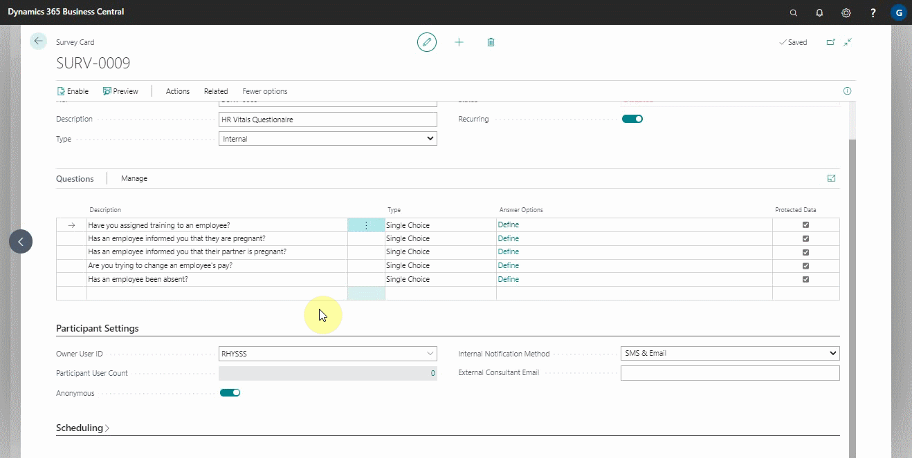

# Setting up an external Consultant Survey to Answer

At times, an external consultant such as the external HR consultant for your company may ask you, the business owner, to fill out a survey with questions that will help them advise you better on HR issues. To conduct this external consultant survey, follow these steps:
1. Import the **stx** file format that the consultant shared with you.
2. In the **Participant User Account** field under the **Participant Settings** section, add your user account as a participant.

   

3. Then, under **Participant Settings** section, enter the external consultant's email address in the **External Consultant Email** field, so that a pdf copy of the answers you provide is sent over.
4. Click **Send Now** to send the survey to your email address for completion.

   

 

### **See Also**

[Setting up and sending internal surveys](garagehive-setting-up-and-sending-internal-surveys.html) \
[Scheduling recurring internal surveys](garagehive-scheduling-recurring-internal-surveys.html) \
[Importing and exporting internal surveys](garagehive-importing-and-exporting-internal-surveys.html) \
[Reviewing internal surveys](reviewing-internal-surveys.html) \
[Importing External Survey Updates](garagehive-importing-external-survey-updates.html)