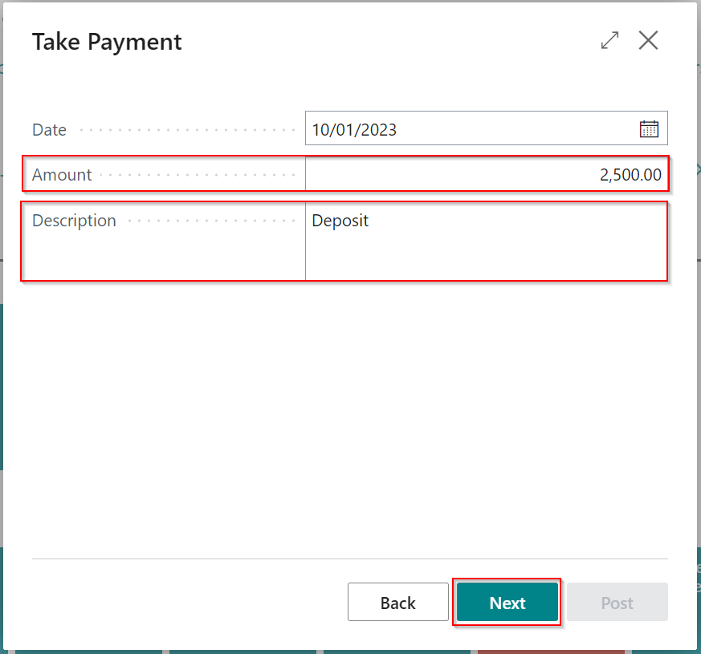

#   Taking a deposit and posting it to a customers account.

See the video below or follow the written instructions to take payments for posted sales documents.

---



---

From the home page, select Take Payment.

Type to search for or use the arrow to select the customer.

Once selected, you will see the customers' balance and select a payment method by typing or selecting as with the customer name.

Now the **"NEXT"** button will be highlighted, and you can progress to the next page.

Un-slide the value **"Apply to Documents"** slider, this will allow you to key in any amount into the **"Amount"** filed. Select Next to continue

Verify the total and alter the description here if necessary then select next. 

On this last page, you can check the Payment details before posting. If you are not using the built-in accountancy module you won't see **"Lump Payment"** as an option.
If you have an integrated card terminal and have selected a card payment method, you will see this option selected by default. This means that when you choose to post this Payment the card terminal will be triggered and the entry posted upon successful Payment. 

