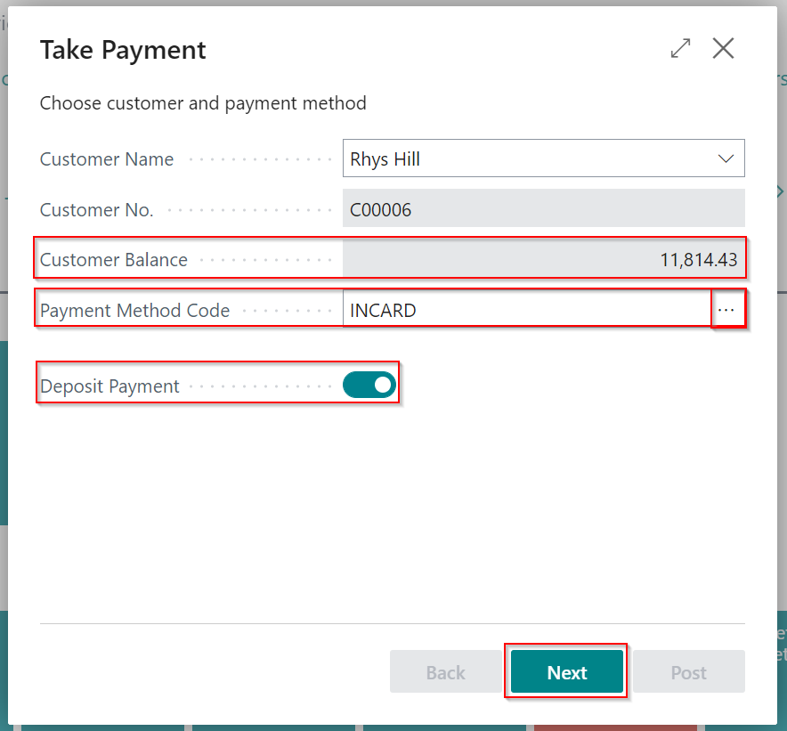
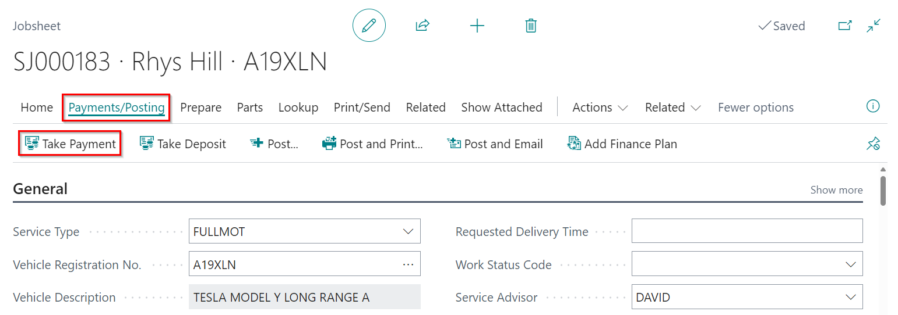
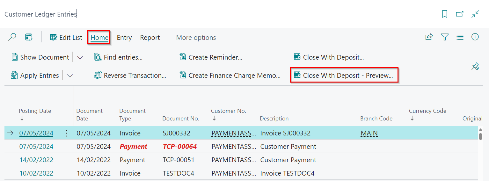

# Managing Deposits in Garage Hive
This article provides guidance on how to take a deposit from a customer, using the deposit as a Payment Method and applying the deposit to posted documents.

## In this article
1. [How to Take a Deposit in a Document](#how-to-take-a-deposit-in-a-document)
2. [How to Post Deposits to Customer Accounts](#how-to-post-deposits-to-customer-accounts)
3. [Using Deposit Amount as Payment Method in a Jobsheet](#using-deposit-amount-as-payment-method-in-a-jobsheet)
4. [Applying Deposits to Posted Documents](#applying-deposits-to-posted-documents)

### How to Take a Deposit in a Document
To take a deposit on a document, such as a Jobsheet, Sales Order, or Sales Invoice:
1. Open the document from which you want to take a deposit, then select **Payments/Posting** from the menu bar, followed by **Take Deposit**.

   

2. Enter the **Payment Method** in the **Payment Method Code** field and click **Next**.

   

3. In the **Amount** field, enter the amount the customer wishes to pay as a deposit for the document. You can also add a description in the **Description** field. Click **Next**.

   

4. Before posting, double-check the deposit's details. If you need to make any changes, click **Back** to return to the previous page.
5. Click on **Post** after reviewing and confirming all the details are correct.
6. You can select to **Print** or **Email** the receipt.

   

[Go back to top](#top)

### How to Post Deposits to Customer Accounts
1. From the **Role Centre**, select **Take Payment**.

   

1. In the **Customer Name** field, type to find and select the customer's name.

   

1. Once selected, the customer's balance will be displayed in the **Customer Balance** field.
1. Click on the ellipsis (...) in the **Payment Method Code** field to select a payment method.
1. Since you want to take a Deposit Payment, select the **Deposit Payment** slider.
1. The **Next** button is now active, and you can proceed to the next page.

   

1. In the next page, enter the amount of the deposit to be received in the **Amount** field and add a description, which is by default **Deposit**.
1. The **Next** button is now active, and you can proceed to the next page.

   

1. Before posting, review the Deposit Payment details on the last page.
1. In the **Receipt** field, choose whether to **Print** or **Email** the receipt.

   

1. If you have an integrated card terminal and have chosen a card payment method, the **Lump Payment** option will be selected by default. This means that if you choose to post this Payment, the card terminal will be triggered and the entry will be posted if the Payment is successful. 

   

1. Select **Post** to post the payment.

   

[Go back to top](#top)

### Using Deposit Amount as Payment Method in a Jobsheet
If you want to use deposit amount as payment method in a Jobsheet:
1. Open the Jobsheet to which you want to apply the deposit.
2. Select the **Payments/Posting** menu and then click **Take Payment**.

   

3. Select **UseDeposit** from the list of payment methods and enter the amount you want to use in the **Amount** column.

   

4. You can also use the **Apply Deposit Amount** action, which appears on the notification at the top,  to use the entire deposit amount available for the customer or to fill in the **Difference** for the amount paid in the **UseDeposit** payment method.
5. Close the payment method window by clicking **Close**.

   

6. You can now **Post** the Jobsheet, and the **Deposit Amount** will be applied to the Jobsheet as a payment method.

[Go back to top](#top)

### Applying Deposits to Posted Documents
1. In the top right corner, choose the  icon, enter **Customer Ledger Entries**, and select the related link.

   

2. Select the document to which you want to apply the deposit, then **Home** from the menu bar, followed by **Close With Deposit - Preview** to preview the posting.

   

3. The **Posting Preview** page appears. After you've confirmed the posting, close the page.

   

4. You can now apply the deposit by selecting **Home** from the menu bar, followed by **Close With Deposit**.

   

5. In the **Deposit Entries** page, select the deposit you want to apply and click **OK**.

   

6. In the notification *"Do you want to post the journal lines?"* select **Yes**.

   

[Go back to top](#top)

 

### **See Also**
[Video: How to take payments & deposits](https://www.youtube.com/watch?v=akx2eeBwRIo){:target="_blank"}
