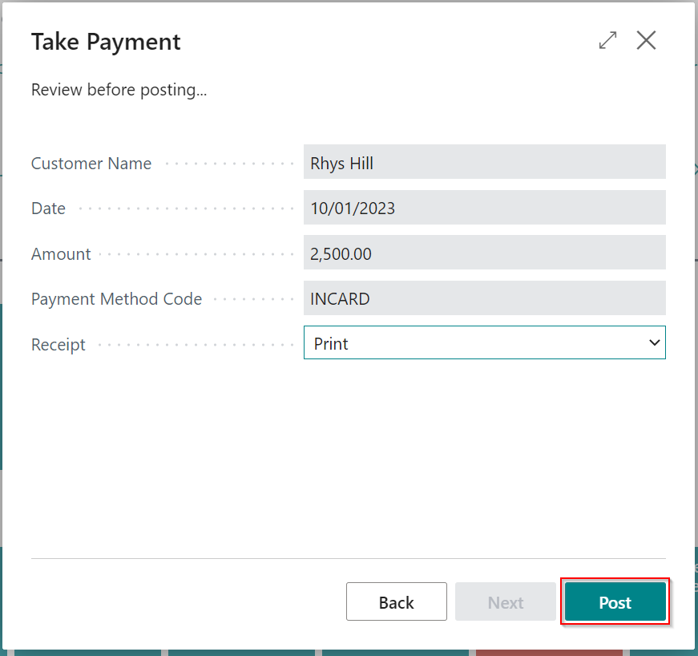

#   Taking Payment for a posted sales document.

See the video below or follow the written instructions to take payments for posted sales documents.
---

---



---

From the home page, select Take Payment.
---

Type to search for or use the arrow to select the customer.
---

Once selected, you will see the customers' ballance and select a payment method by typing or selecting as with the customer name.
---

Now the **"NEXT"** button will be highlighted, and you can progress to the next page.
---
Select the value **"0.00"**
---

In this screen you can select the documents you wish to pay by selecting the **"Payment Made"** check box and if necessary change the value paid in the **"Amount received"** column if it differs from the balance of the document (note the amount received will default to the full amount outstanding when the Payment made check box is selected)
---

Verify the total and alter the description here if necessary then select next. 
---

On this last page, you can check the Payment details before posting. If you are not using the built-in accountancy module you won't see **"Lump Payment"** as an option.
If you have an integrated card terminal and have selected a card payment method, you will see this option selected by default. This means that when you choose to post this Payment the card terminal will be triggered and the entry posted upon successful Payment. 
---

