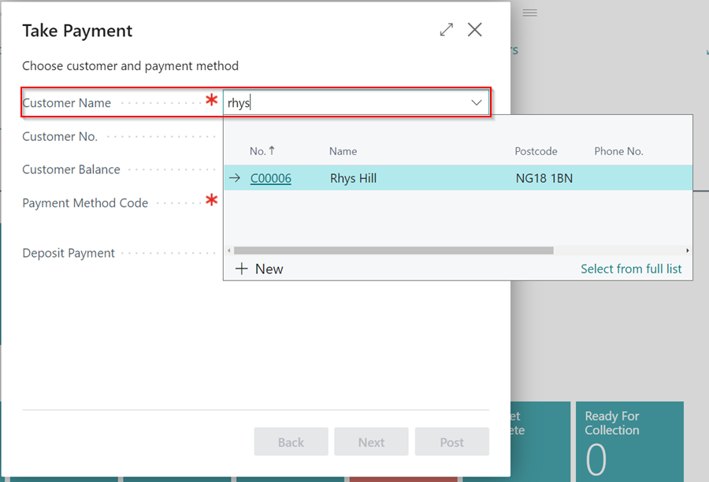

# Take Payment for Posted Documents

See the video below or follow the written instructions to take payments for posted sales documents.

---



---

1. From the home page, select **Take Payment**.

   

2. Enter the customer's name or click the arrow to select the customer.

   

3. When you select a customer, you will see their balance. In the **Payment Method Code** field, type or click the three dots to select a payment method.

   

4. The **Next** button will now be active; click it to proceed to the next page.
5. In the **Amount** field, click on the value **"0.00"**.

   

6. On this page, you can pay for the documents you want by checking the **"Payment Made"** box. If the value paid differs from the balance of the document, change it in the **"Amount received"** column. When the Payment made check box is selected on any document, the amount received will default to the full amount owed.

   

7. Verify the total and, if necessary, change the description here before moving on to the next step.
   
   

8. Before posting, you can review the Payment details on this final page. If you do not use the built-in accounting module, you will not see the **Lump Payment** option.
9. If you have an integrated card terminal and have chosen a card payment method, the **Lump Payment** option will be selected by default. This means that if you choose to post this Payment, the card terminal will be triggered and the entry will be posted if the Payment is successful. 

   

 

### **See Also**

[Video: Take Payment for Posted Documents](https://www.youtube.com/watch?v=akx2eeBwRIo){:target="_blank"}