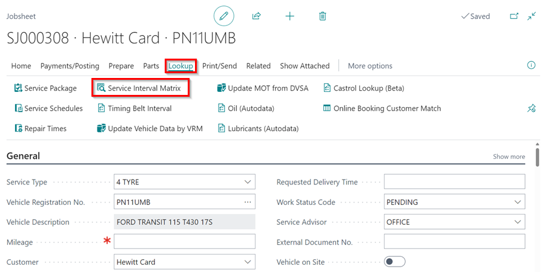
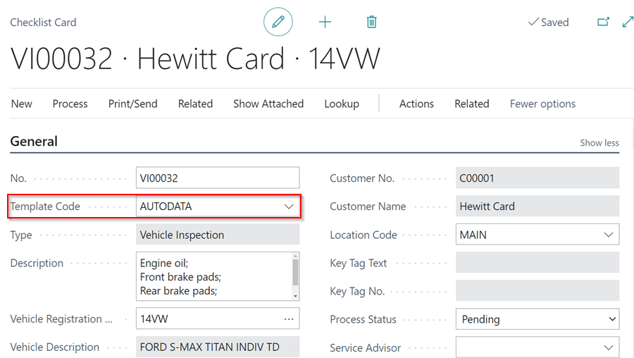

# Creating a Vehicle Inspection Checklist from Autodata
When using the Autodata **Service Interval Matrix**, you may create a Vehicle Inspection Checklist with the data from Autodata, allowing you to generate a quotation for the customer.
1. Select **Lookup** from the actions bar of the document you're working on, then **Service Interval Matrix**. In the pop-up notification, click **Yes**.

   

2. Check the **Include** checkbox next to the **Service Times** and **Service Intervals** you want to include. From the actions bar, select **Next**.

   

3. Select **Create Vehicle Inspection** from the actions bar on the page that opens.

   

4. There will be a **Vehicle Inspection** Checklist created, with the template **AutoData**. To open it, click **Yes** on the pop-up notification.

   

   

4. When you want to add an additional Checklist template for each Checklist you create, in the top right corner, choose the  icon, enter **Autodata Setup** and select the related link.

   

5. Go to the **Additional Checklist Templ. Code** field and choose the template to use for all Autodata checklists. Close the **Autodata Setup** page.

   

6. If you now create a Checklist from Autodata, it will include the additional template checklist alongside the one from Autodata.