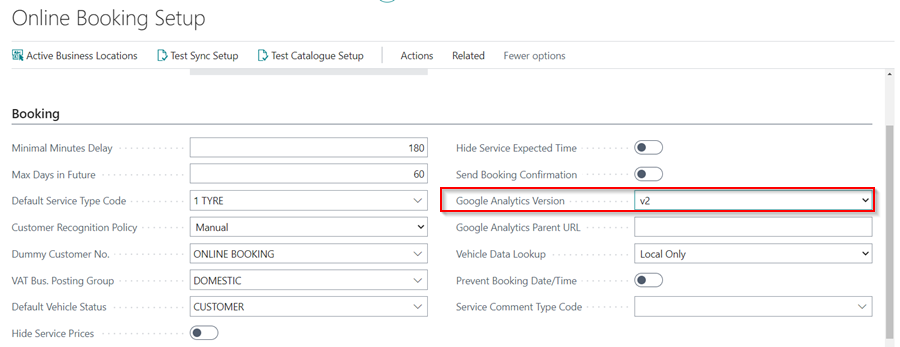
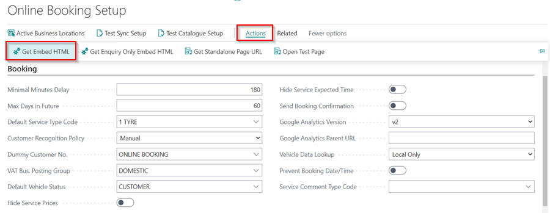
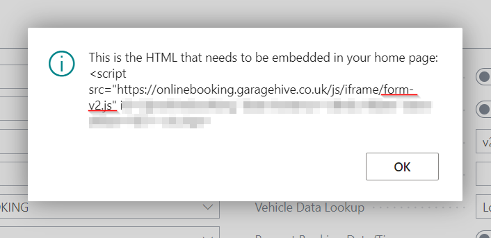
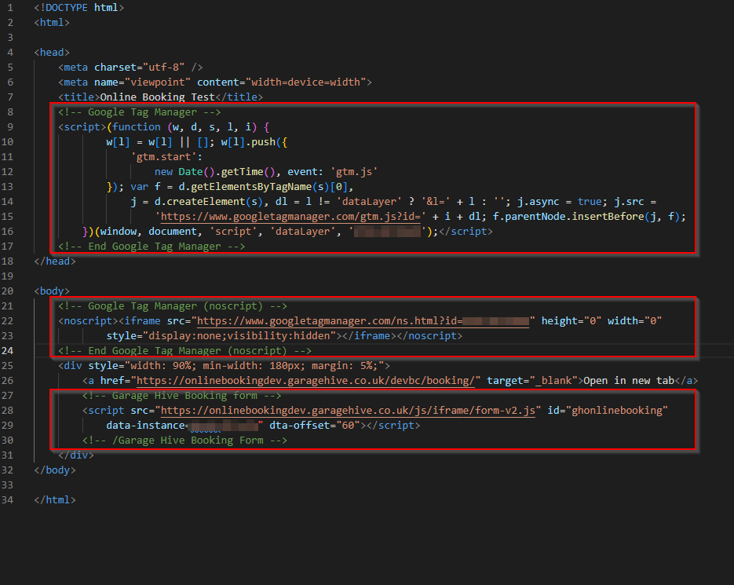
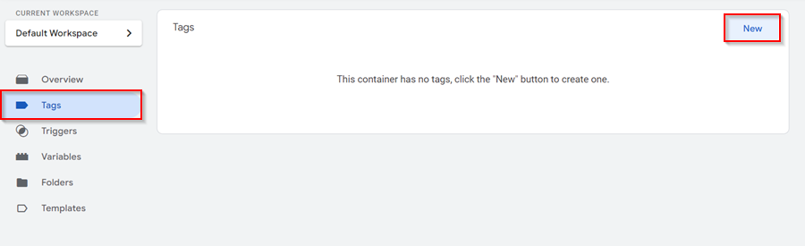
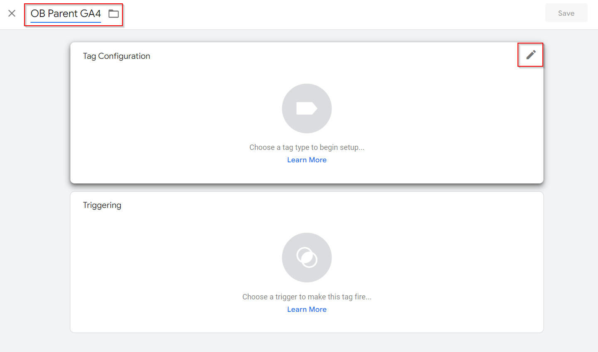
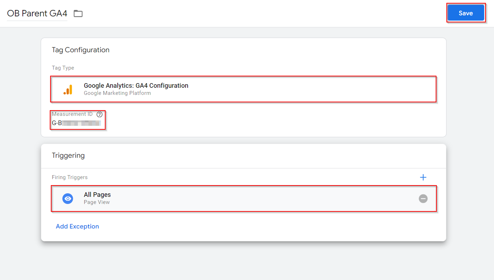
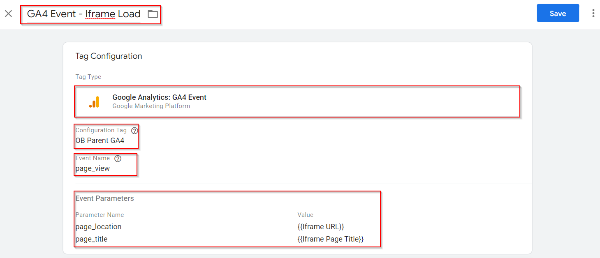
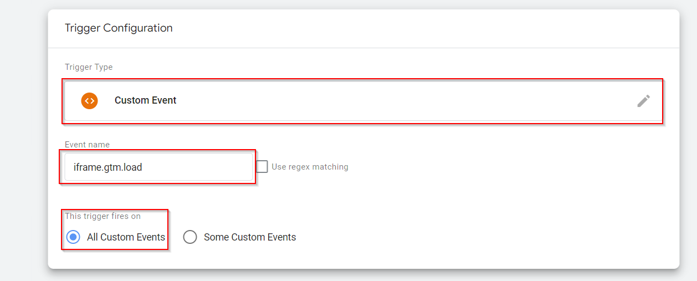
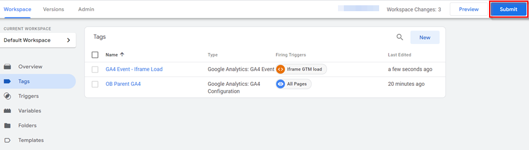

# We are still working on this article!
We are currently reviewing this article before it is published, check back later.

# Online Booking and Google Analytics Setup in Garage Hive
This article explains how to setup Garage Hive Online Booking embedded iframe analytics to work with Google Tag Manage (GTM) and Google Analytics 4 (GA4) in the parent webpage. The parent webpage must have GTM with two tags: GA4 and the custom page load event tag. This solution is only compatible with GTM and GA4, not Google Universal Analytics (UA-). Please keep in mind that the GTM User Interface (UI) may have a learning curve.

## In this article
1. [Get the Online Booking HTML embed script](#get-the-online-booking-html-embed-script)
2. [Parent Page Example](#parent-page-example)
3. [Google Tag Manager Setup](#google-tag-manager-setup)

### Get the Online Booking HTML embed script
1. In the top right corner, choose the  icon, enter **Online Booking Setup**, and select the related link.
2. Change the **Google Analytics Versions** field to **v2** under the **Booking** FastTab.

   

3. Then, from the menu bar, select **Actions** followed by **Get Embed HTML** to obtain a new version of the Online Booking HTML embed script.

   

4. Note that the change between V1 and V2 is in the Java Script (JS) file name – V1 is “form.js” and V2 is “form-v2.js”.

   

### Parent Page Example
The following is an example of a parent page with **Google Tag Manager** default scripts and **Garage Hive Online Booking** embed script.

   

### Google Tag Manager Setup
Google Tag Manager needs to have 2 Tags set up – one is GA4 Configuration for the parent page general analytics and the second is GA4 Event to catch the custom iframe page load event and forward it to GA4.
1. Open **Google Tag Manager** and select **Tag** on the left side, followed by **New**.

   

2. Enter the tag's name in the top left corner and click the **Tag Configuration** edit button.

   

3. Select **Google Analytics: GA4 Configuration** as the **Tag Type** and enter the **Measurement ID** (starts with G-). You should create a new GA4 instance and obtain the measurement ID from there, [learn more](https://support.google.com/analytics/answer/9744165#use_existing_tags&zippy=%2Cin-this-article).
4. Then, for **Triggering**, click the edit button and choose **All Pages**. Click **Save**.

   

5. Select **New** to create a new tag, and then setup the **Tag Configuration** as shown in the image below. This is to capture an iframe event and transform it to match a GA4 parameter so that it can be logged as a page view event.

   

6. Click on the **Trigger Configuration** edit button and change the settings as shown in the image below.

   

7. You should now have the two tags in place. Click the **Submit** button.

   

[Go back to top](#top)