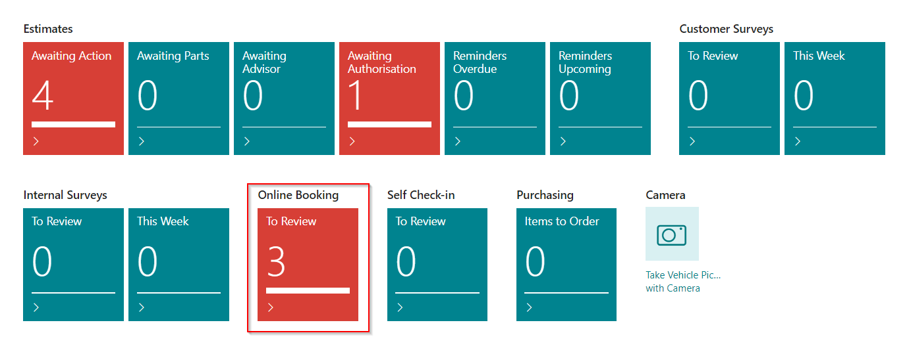
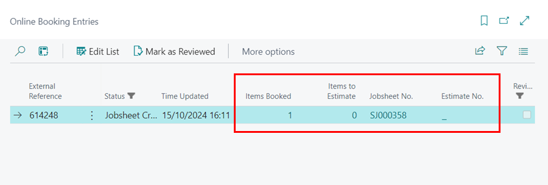
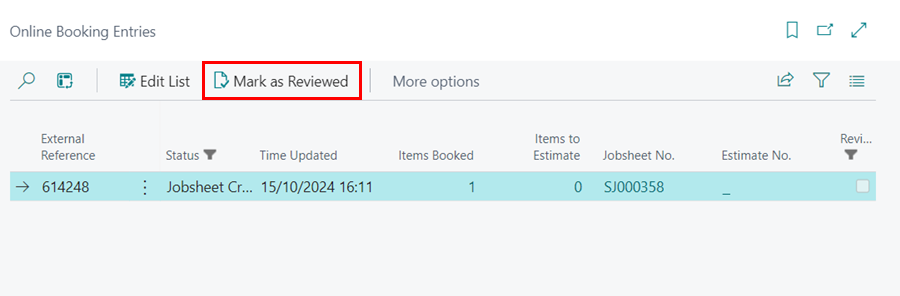

# Reviewing Online Bookings and Enquiries
1. When an **Online Booking or Enquiry** is made, the notification appears in the **To Review** tile under the Online Booking section.

   

2. To view the bookings and enquiries, click on the tile. Each line shows the **Items Booked**, which means the customer created a Jobsheet, and the **Items to Estimate**, which means the customer created an estimate.
3. To open the respective documents, click on **Jobsheet No.** or **Estimate No.**.

   

4. After reviewing a line, select it and choose **Mark as Reviewed** from the actions bar.

   