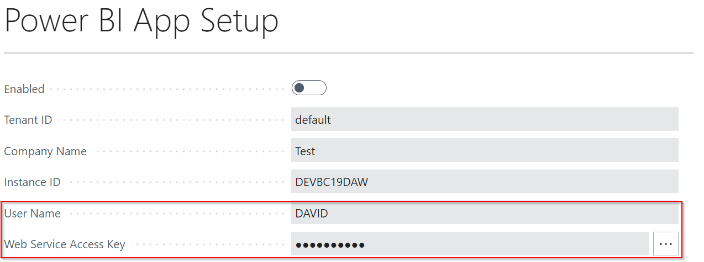

# Vostel Integration with Garage Hive Using Oona Web App
**Oona Web App** is used to call numbers directly from the Garage Hive contact list. So, if you hover your mouse cursor over the contact you want to call, you'll see the option to call their phone number. You can also open the contact card directly when you receive a call from a contacts saved in Garage Hive.

## In this article
1. [Oona web app setup](#oona-web-app-setup)
2. [How to use Oona web app in Garage Hive](#how-to-use-oona-web-app-in-garage-hive)

### Oona web app setup
1. To start the setup, you will need to register for a Stan account with Vostel. Follow this [link](https://stan.vostel.co.uk/#/auth/register) to register. If you have already registered you can log it to your account.

   

2. Install the **Oona web app** on your browser: 
      - for **Google Chrome** use this [link](https://chrome.google.com/webstore/detail/oona/cjkdcianhkjonebdjldgdfmakjncgdee), and click on **Add to Chrome**, followed by **Add Extension**.

      - for **Microsoft Edge** use this [link](https://chrome.google.com/webstore/detail/oona/cjkdcianhkjonebdjldgdfmakjncgdee) and click on **Add to Chrome** from Chrome webstore, followed by **Add Extension**.
      - for **Firefox** search for Oona in the add-ons page.
3. After you've installed the Oona app, go to your stan account, enter your **Extension**, and then generate and copy the **API Key**.
4. Click on **Update Profile** to save the settings.

   

5. Click on the **Oona app** in your web browser extensions, enter your **Email** and **API Key**, and then click **Submit**.

   

6. Close and reopen your web browser.
7. Login to Garage Hive and search for **Phonebook Setup** and copy the **API URL**, and then search for **Power BI App Setup**, and copy the **User Name** and the **Web Service Access Key**.

   

   

8. Send what you've copied to [**support@vostel.co.uk**](mailto:support@vostel.co.uk).

### How to use Oona web app in Garage Hive
1. After completing the Oona web app setup, you can now use the web app by hovering over a customer's phone number or mobile phone number from the customers' list, where you will see an option to call the number.

   

2. When you receive a call, you can click on the incoming call notification which opens the customer's **Phonebook Contact Card**.

   

3. From the **Phonebook Contact Card** you can:
     - Take payment form the customer.
     - View the schedule for any allocation of the customer.
     - View the customer details from the factbox.
     - Open and edit any service documents for the customer.

      

 

### **See Also**
[Video: Phone Integration with Vostel](https://www.youtube.com/watch?v=temsuE1WNUw){:target="_blank"}

