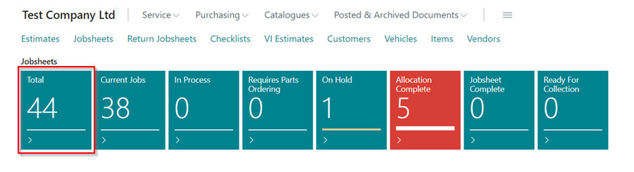
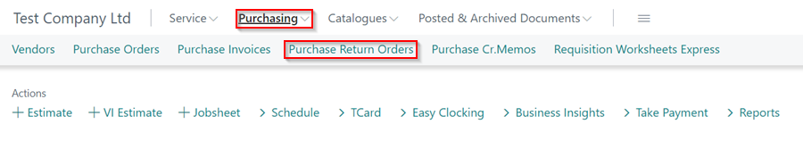
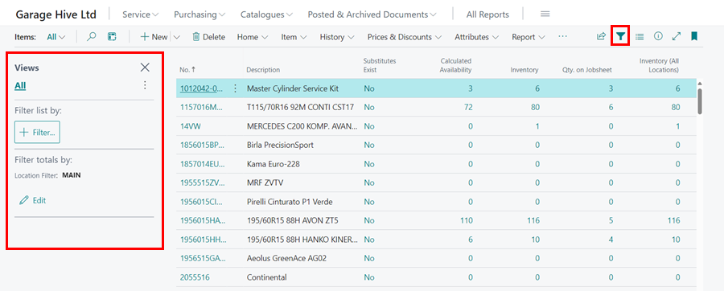
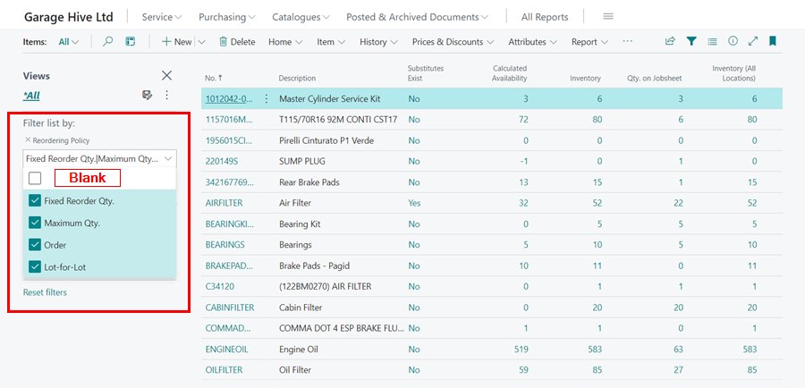
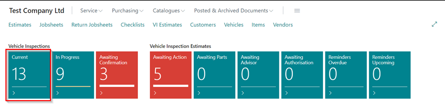
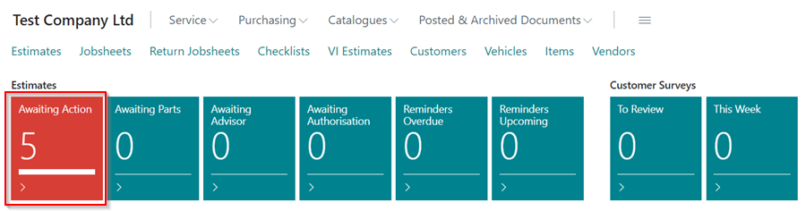
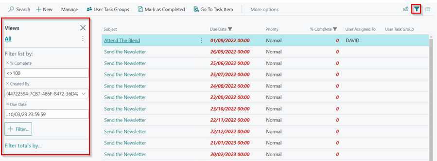
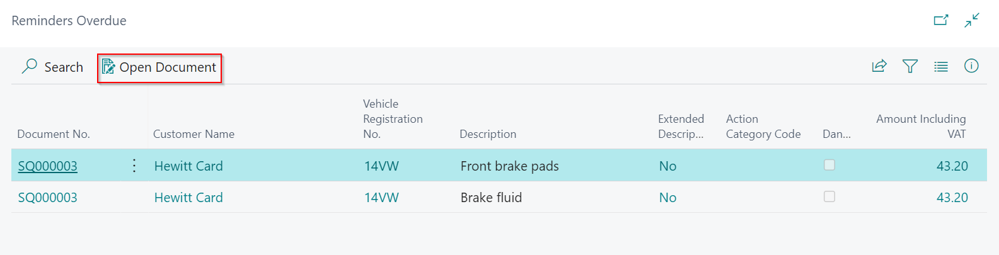
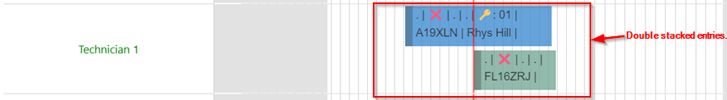

# We are still working on this article!
We are currently reviewing this article before it is published, check back later.

# How to Audit and Cleanse the Use of Garage Hive System
As the Garage continues to use more features in the Garage Hive system, it is important to make sure that the features are used efficiently and effectively. This is where a system audit/cleanse comes in. A system audit/cleanse helps in reviewing your current processes and workflows in order to continuously improve effectiveness and optimise the use of Garage Hive features. In this article, we'll look at what you can do on a weekly, monthly, and annual basis to audit and cleanse your system.



## Weekly Routines
These routines should be done on a weekly basis.

### Jobsheets
To clean up the Jobsheets:
1. From the Role Centre, click on the **Total** tile under the **Jobsheets** to open the list of all Jobsheets that have been created.

   

2. Select the filter icon on the right of the menu bar to reveal the **filter** panel.

   

3. Add a **Booking Date** filter to the filter panel by clicking the **+Filter** button and searching for Booking Date. In the **Booking Date** filter, enter **''&#124;..T-1d**. This is the filter for all bookings made in the past, up until yesterday.

   

4. The filtered list includes all jobs that are not on the schedule and were booked in the past, up until yesterday. Check that all of the jobs are correct, that they have been posted/deleted, and that all of the lines are filled out correctly. 

### Purchase Orders and Purchase Return Orders
To clean up the Purchase Orders:
1. Select the **Purchasing** menu from the navigation bar in the Role Centre, and then **Purchase Orders** to view a list of all open Purchase Orders.

   

2. Examine each Purchase Order and ensure that all open Purchase Orders are awaiting parts or an invoice. Make sure you understand why the parts are still in the Purchase Order; if not, remove them and delete the purchase.
3. The same is true for Purchase Return Orders; select the **Purchasing** menu from the Role Centre's navigation bar, and then **Purchase Return Orders** to view a list of all open Purchase Return Orders and go through each one.

   

### Items
To clean up the Items list:
1. Select the **Catalogues** menu from the navigation bar in the Role Centre, and then **Items** to view a list of all the item cards created.

   

2. Select the filter icon on the right of the menu bar to reveal the **filter** panel.

   

3. Add a **Reordering Policy** filter to the filter panel by clicking the **+Filter** button and searching for Reordering Policy. In the **Reordering Policy** filter, select all the options apart from the one that is blank. The reason for selecting all except blank is that Garage Hive only supports **Maximum Quantity**, and by selecting all, you will be able to see any other that is not Maximum Quantity and correct it.

   

4. Check the items on the filtered list and confirm that they are supposed to be in stock. If not, open the item card for each item that isn't supposed to be in stock and select the **Reordering Policy** as blank.

   

### Items to Return Report
After going through the Items list and removing the **Reordering Policy** for the items that are not supposed to be in stock, you can now access the **Items to Return** report so as to return the items that are not needed or write them off. To access the **Items to Return** report:
1. Select the **Reports** actions menu, **Additional** and then **Items to Return**.

    

2. The **Items to Return** report should be empty. You can create **Purchase Return Orders** for the items on the list (to return them to the supplier), click [here](garagehive-items-to-return.html) to learn more, or you can write the items off the system using an **Internal Jobsheet** (if the item has been lost), click [here](garagehive-internal-jobsheet.html) to learn more.

   

### Physical Inventory Journal
After going through the entire auditing process, the final step is to take a physical inventory of the items in the system. Physical stock takes enable comparisons between items in the system and those that are physically available. You cannot conduct a physical stock take without first going through the system auditing processes. Follow this [link](garagehive-doing-physical-stock-take.html) to learn more about how to carry out a **Physical Stock Take**.

### Vehicle Inspections
To clean up the Vehicle Inspections:
1. From the Role Centre, click on the **Current** tile under the **Vehicle Inspections** to open the list of all Vehicle Inspections that have been created.

   

2. Select the filter icon on the right of the menu bar to reveal the **filter** panel.

   

3. In the **Jobsheet Booking Date** filter, enter **"&#124;..T-1d**; this filters all Vehicle Inspections made in the past, up until yesterday, and then in the **Process Status** filter, select **Pending** and **In Progress**; this filters all Vehicle Inspections that have not been completed.

   

4. Examine why all of the Vehicle Inspections in the filtered list have not been completed.

### Estimates
To clean up the Estimates:
1. From the Role Centre, click on the **Awaiting Action** tile under the **Estimates** to open the list of all Estimates that have been created.

   

2. Select the filter icon on the right of the menu bar to reveal the **filter** panel.

   

3. In the **Estimate Status** filter, select **Awaiting Action**, **Awaiting Parts**, **Awaiting Advisor**, and **Awating Authorisation**; this filters all Estimates that have not been completed, and then add a **Created At** filter to the filter panel by clicking the **+Filter** button and searching for Created At, enter **"&#124;..T-1d** in the **Created At** filter; this filters all Estimates made in the past, up until yesterday.

   

4. Examine why all of the Estimates in the filtered list have not been completed.

### User Tasks
To clean up the User Tasks:
1. From the Role Centre, click on the **Raised by Me Due** tile under the **User Tasks** to open the list of User Tasks that have been created.

   

2. Select the filter icon on the right of the menu bar to reveal the **filter** panel.

   

3. Remove the **Created by** filter to see all tasks created. Check why the tasks have not yet been completed and follow through to ensure they are complete before removing them from the list by clicking the **Mark as Completed** button.

   

### Vehicle Inspection Estimates and Estimates Reminders
To clean up the Reminders:
1. The **Reminders Overdue** tile under the **Vehicle Inspection Estimates** and **Estimates** tiles in the Role Centre should always be zero. 

   

2. If there are documents in the tiles, click on the tile, select the document from the list, and then click **Open Document** from the menu bar to follow up on the reminder.

   

### Schedule
To clean up the Schedule:
1. Check that there are no double-stacked allocation entries for a single resource; if there are, move one of the allocations to a later time or day.

   

2. The second thing to look for is any **blue (Pending - this is an allocation that hasn't been started)** or **red (On Hold - this is a paused allocation)** allocations from the previous period. Click on the **Previous Period** from the menu bar, and check to see if any of the allocations are blue or red; if so, move them to a future date.

   

### Surveys
To clean up the Surveys:
1. Scroll down to the **Customer Surveys** and **Internal Surveys** tiles in the Role Centre. Check that the **To Review** tile is zero.

   

2. If there are surveys in the **To Review** tiles, click on the tile, read the survey, and then click **Mark It Reviewed**.

# Checking the power bi report weekly

[Go back to top](#top)