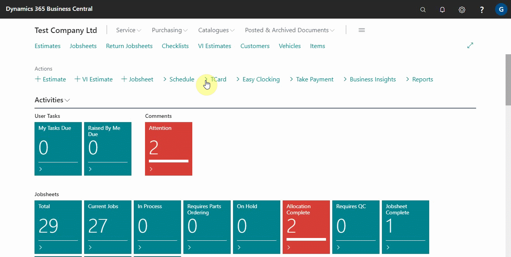
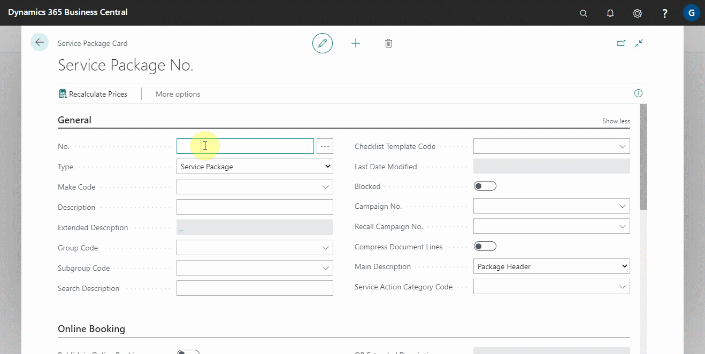
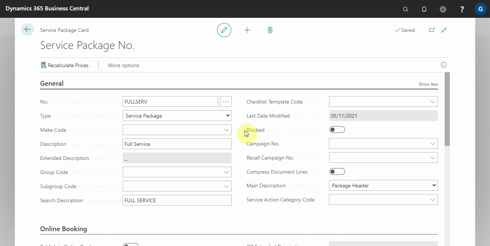
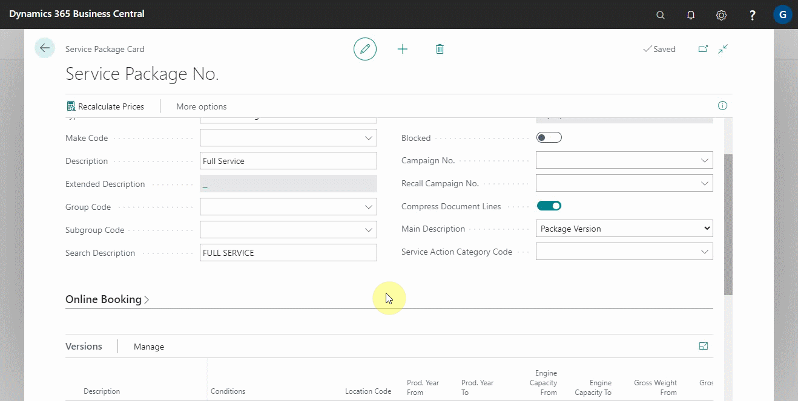
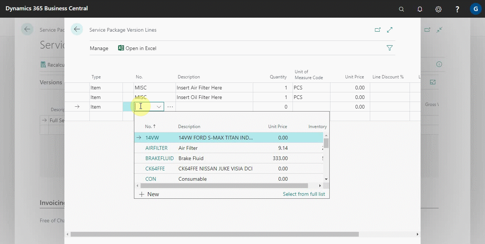
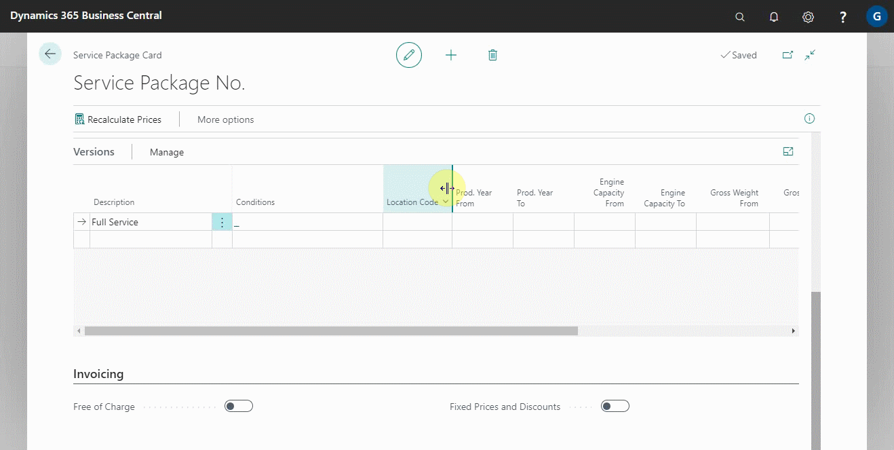
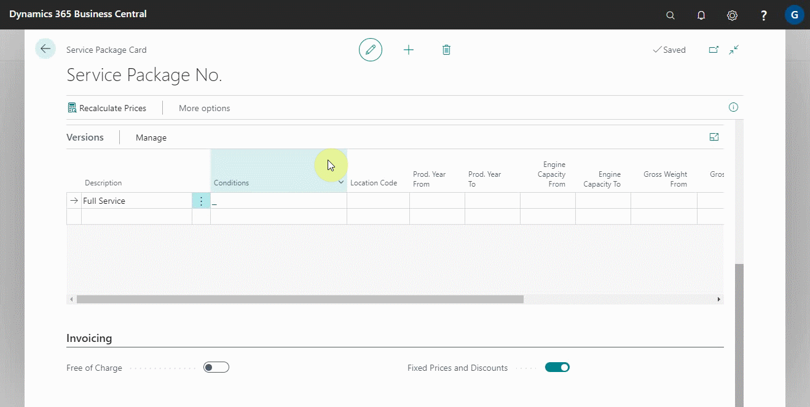
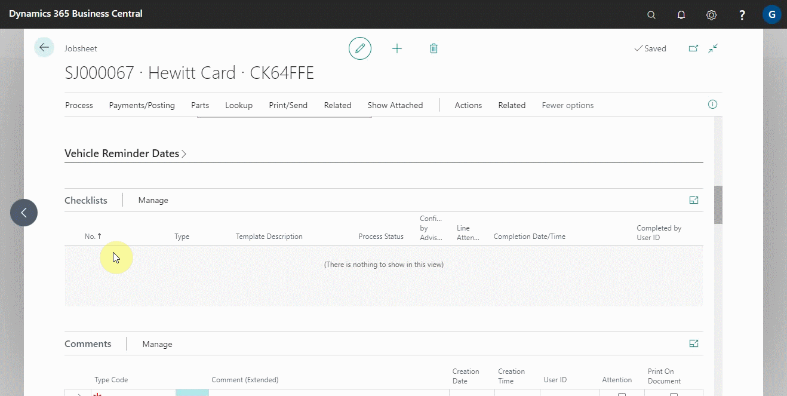

This article explains how to setup Garage Hive Online Booking embedded iframe analytics to work with Google Tag Manage (GTM) and Google Analytics 4 (GA4) in the parent webpage. The parent webpage must have GTM with two tags: GA4 and the custom page load event tag. This solution is only compatible with GTM and GA4, not Google Universal Analytics (UA-). Please keep in mind that the GTM User Interface (UI) may have a learning curve.

## In this article
1. [Get the Online Booking HTML embed script](#get-the-online-booking-html-embed-script)
2. [Parent Page Example](#parent-page-example)
3. [Creating New Service Package Versions by Copying from Other Versions](#creating-new-service-package-versions-by-copying-from-other-versions)
4. [Adding Checklist Template Code to Service Package Card](#adding-checklist-template-code-to-service-package-card)

### Get the Online Booking HTML embed script
1. In the top right corner, choose the  icon, enter **Online Booking Setup**, and select the related link.
2. Change the **Google Analytics Versions** field to **v2** under the **Booking** FastTab.

   

3. Then, from the menu bar, select **Actions** followed by **Get Embed HTML** to obtain a new version of the Online Booking HTML embed script.

   

4. Note that the change between V1 and V2 is in the Java Script (JS) file name – V1 is “form.js” and V2 is “form-v2.js”.

   

### Parent Page Example
The following is an example of a parent page with **Google Tag Manager** default scripts and **Garage Hive Online Booking** embed script.

   

Service packages are a powerful tool for helping you build jobs faster, simplify job pricing, and add consistency.

To create or edit a service package: 
1. Open the service packages list, by selecting **Catalogues** and then **Service Packages** from the role centre navigation menu.
2. From the **Service Package List** page, you can either edit an existing service package or create a new service package by selecting the **New** action. 

   

3. Fill in a **Service Package No.** (often an abbreviation of the description) and a **Description** for the package in the **Service Package Card**.

   

4. In the **General** FastTab, there is a slider for **Compress Document Lines**, which, when enabled, compresses all the lines in this package on the printed document to show only the package description and its value.
5. In the **Main Description** field, select either **Package Header** or **Package Version**. This determines the description that will be added to the document; package header is the description in the **General** FastTab, and **Package Version** is the description of the version that you are about to setup in the **Versions** sub-page.

   

   

6. Under the **Versions** sub-page, you can now create any version of this package that you want. Add a description and select **Manage** then **Version Lines** to add item and labour lines to this version.

   

   

   

### Adding Fixed Price and Discounts for the Service Package
1. There is a **Fixed Price and Discounts** slider at the bottom of the **Service Package Card** under the **Invoicing** FastTab; if enabled, you will be able to change the prices and discounts within the versions. When versions are added to documents, prices or discounts in the versions are added to the document rather than being pulled from the related labour or item card or any pricing matrix that has been setup. If you try to change the price on the document, you will be warned that it is part of a fixed price package and asked whether you want to break that special pricing.

   

2. In addition, within the version lines, you will see an additional column **Allow fixed price Qty. Change**. If you choose this option, the system will allow you to change the quantity of that version line. It will adjust the unit price to maintain the line value. This is ideal for items such as engine oil, where the exact quantity cannot be predicted.

   

### Creating New Service Package Versions by Copying from Other Versions
1. When you begin creating new versions, you may find the need to copy versions if they are very similar. To do this, select **Manage** and from the submenus, you will see two options; **Copy**, which copies the selected version to the line beneath, and **Copy From**, which allows you to select versions from other packages to copy into this one.

   

### Adding Checklist Template Code to Service Package Card
1. We've also added the ability to add **Checklist Template Code** to a **Service Package Card** so that service packages can automatically add checklists to jobs when they're added to a jobsheet. To add a **Checklist Template Code**, select it from the **General** FastTab field named **Checklist Template Code**.

    

2.  As a result, when you create a new jobsheet and select the **Service Type** as one of the available **Service Packages** with a **Checklist Template Code**, the checklist is automatically added to the jobsheet.

    

[Go back to top](#top)

 

### **See Also**

[Video: How to create Service Packages in Garage Hive](http://www.youtube.com/watch?v=J1-KVnbnBLs){:target="_blank"} \
[Setting up Service Packages conditions](/docs/service-package-conditions.html) \
[Setting up Service Packages for online booking](/docs/garagehive-onlinebooking-service-packages.html) \
[Automatically adding Service Packages in documents](/docs/garagehive-automatically-adding-service-packages.html)