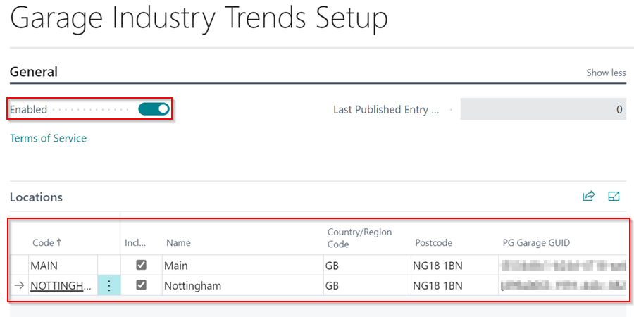
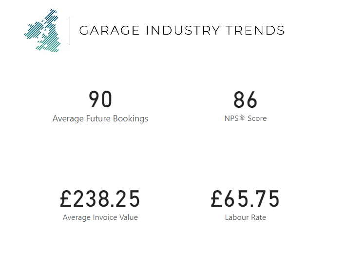

### Garage Industry Trends
[Garage Industry Trends](https://www.garageindustrytrends.com/){:target="_blank"} is an opt-in service for garages in various parts of the United Kingdom in which they agree to share their business performance data anonymously on a regular basis in order for everyone to be aware of industry trends. It combines four key performance indicators (KPIs), namely:
   * **Average Invoice Value**
   * **Labour Rate**
   * **Count of Future Bookings**
   * **NPS**

      

Any Garage Hive customer can opt-in to the service and share their data anonymously, as the more garages that participate, the more accurate the industry averages will be. Before you opt-in, please read the **Terms of Service** [here](https://garagehive.co.uk/tos/). The following is the process for opting in:
1. Scroll down to the **Garage Industry Trends** section on the Garage Hive **Home Screen** and select the **Enable** action.

   

2. Select the check box for the locations to share data for in the **Include** column under the **Locations** sub-page, and enter the **Country/Region Code** and **Postcode** for the location.
3. Then, select the **Enabled** slider to enable the service. Click **Yes** on the pop-up notification to confirm that you have read the **Terms of Service**.

   

4. The service is now activated, and your garage's data will be shared and presented as a rolling 30-day average in combination with data from garages that have opted-in.

   
