

# We are still working on this article!
We are currently reviewing this article before it is published, check back later.

# Automatically Apply Bank Holidays to the Service Schedule
The **Bank Holiday Schedule Integration** allows you to automatically apply public holidays to the schedule. Once enabled, public holidays are greyed out in the schedule, making non-working days easy to identify. Based on the region specified in your Company Information, the system automatically applies Bank Holidays using the base calendar for that region—no manual input required. To setup:

## In this article
1. [Setting Up the Company Base Calendar](#setting-up-the-company-base-calendar)
2. [Setting Up Location Specific Base Calendars](#setting-up-location-specific-base-calendars)
3. [Adding Additional Bank Holidays](#adding-additional-bank-holidays)

### Setting Up the Company Base Calendar
1. Begin by confirming that the **Country/Region Code** in your Company Information is correct. In the top right corner, select the  icon, enter **Company Information**, and choose the related link.

   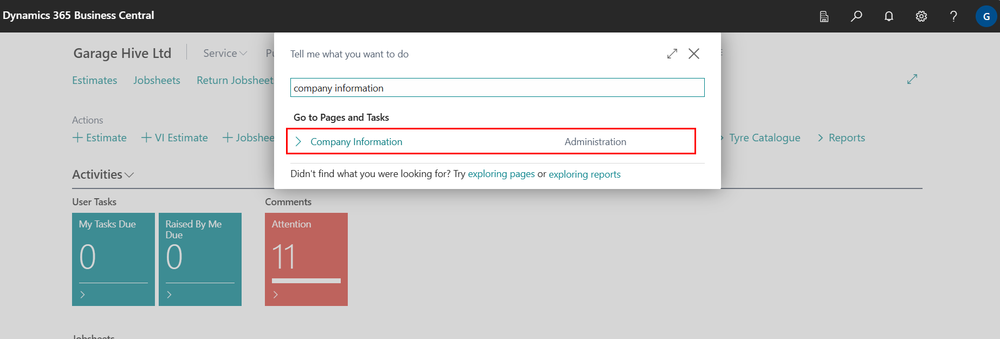

2. In the **General** FastTab, check the **Country/Region Code** field to see which region is currently set. If needed, you can change it by selecting a different region from the list. Exit the page when done.

   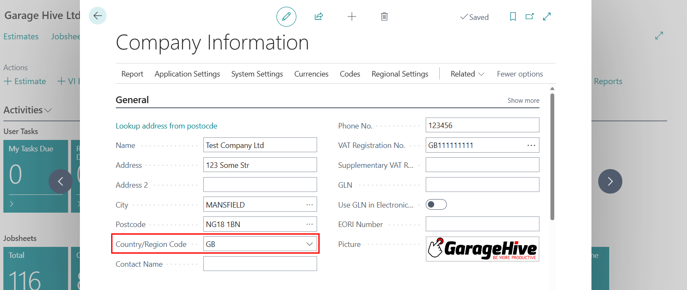

3. Next, search for **HR Integration Setup**, and open the related link.

   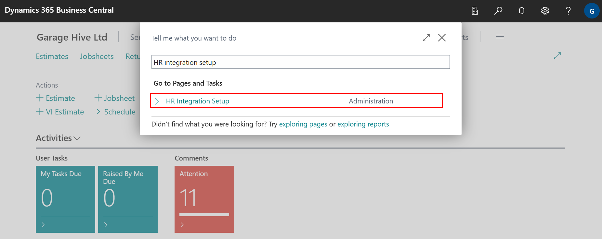

4. In the **General** FastTab:  
   - Choose the appropriate **Default Base Calendar Code** based on your region.  
   - Enable the **Sync Public Holidays** slider under the **Sync Task** section.

      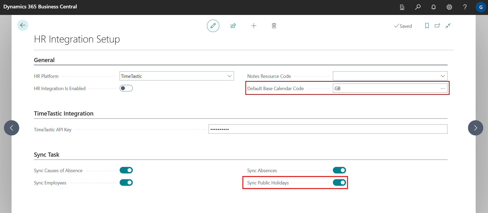

5. Then, turn on the **HR Integration is Enabled** slider. The system will automatically sync public holidays at midnight.

   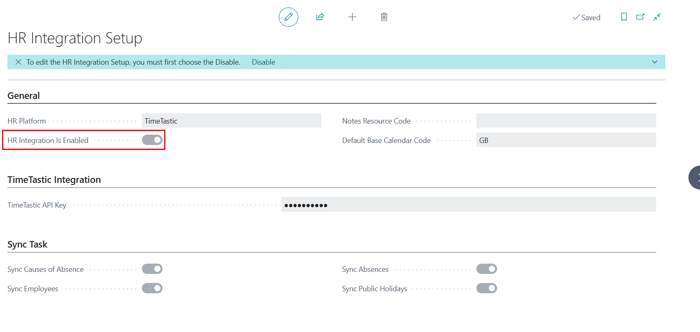

6. Once the sync is complete, Bank Holidays will be shown in the schedule view, greyed out for easy identification. A holiday label will also appear in the top-right corner of the affected day in the schedule.

   

[Back to top](#top)

### Setting Up Location-Specific Base Calendars
1. To set up a base calendar for a specific location, search for **Locations** and select the related link.

   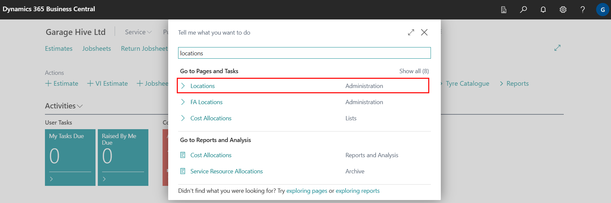

2. Choose the location you wish to update. In the **Location Card**, under the **Warehouse** FastTab, update the **Base Calendar Code** to the one you want to assign. Exit the page when done.

   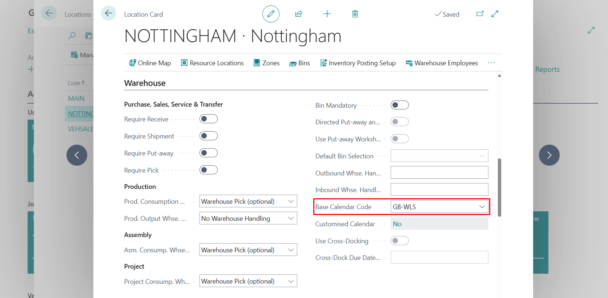

3. The calendar will sync overnight, and the selected location will start using the new base calendar from the next day.

   

[Back to top](#top)

### Adding Additional Bank Holidays
If you need to manually add extra Bank Holidays:
1. In the top right corner, select the  icon, enter **Base Calendars**, and choose the related link.

   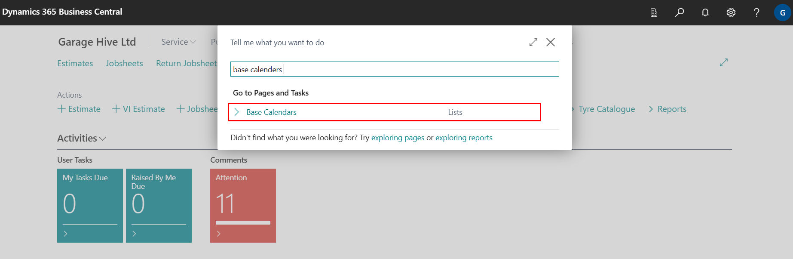

2. Open the base calendar you want to edit. From the menu bar, click **Manage**, then **Edit**.

   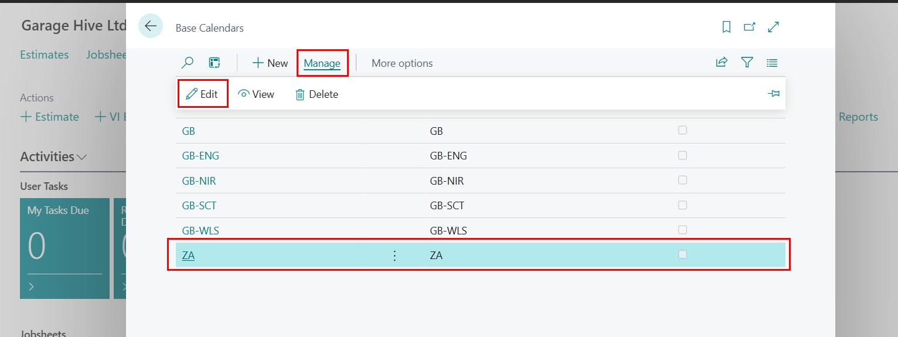

3. In the **Lines** section:  
   - Find the date you'd like to add as a holiday.  
   - Tick the checkbox under the **Non-working** column for that day.  
   - Enter a description of the holiday in the **Description** field.

      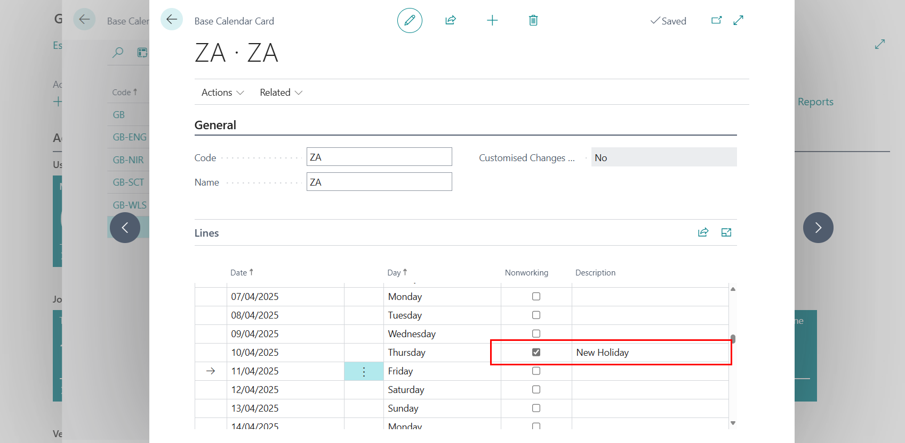

4. Once the next holiday sync occurs (at midnight), the new holiday will appear on the schedule view.

   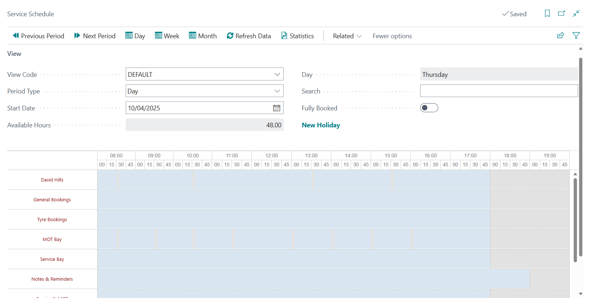

[Back to top](#top)
