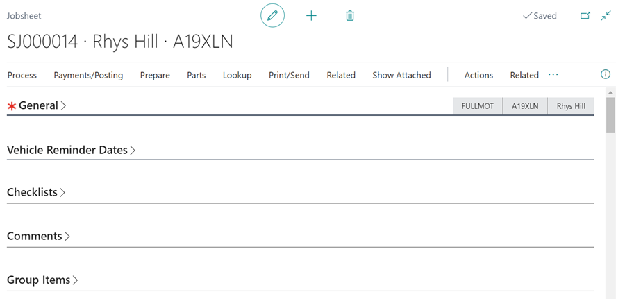
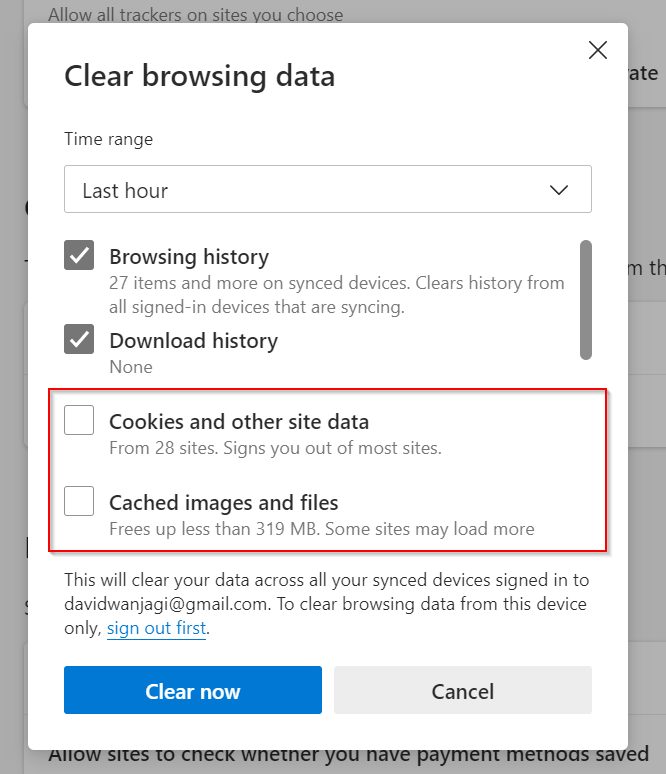
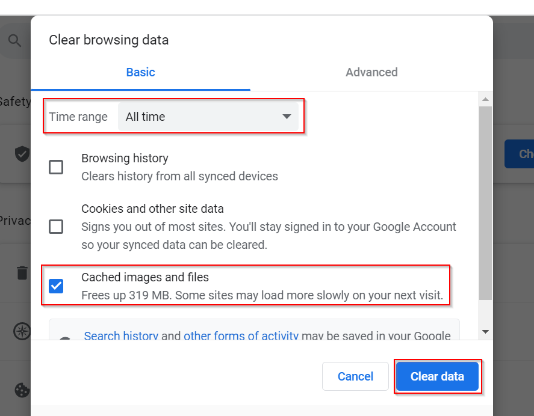

# Upgrade to Version 20 of Business Central Known areas of impact

### 1. The FastTabs are closed by default, you will need to click on them to reopen them.

   

### 2. The textbox on email from Jobsheet or VIE's may disappear.
To resolve this:
   - Delete cache and cookies in the new **Microsoft Edge**:
      1. Open Microsoft Edge, select Menu (3 dots icon on top right corner of the browser) > **Settings** > **Privacy & services**.
      2. Under Clear browsing data, select Choose what to clear.
      3. Select **Cached images and files** and **Cookies and other site data** check box and then select **Clear**.

         

   - In **Google Chrome**:
       4. On your computer, open Chrome.
       5. At the top right, click **More**.
       6. Click **More tools**. Clear browsing data.
       7. At the top, choose a time range. To delete everything, select **All time**.
       8. Next to **Cookies and other site data** and **Cached images and files** check the boxes.
       9.  Click **Clear data**.

         