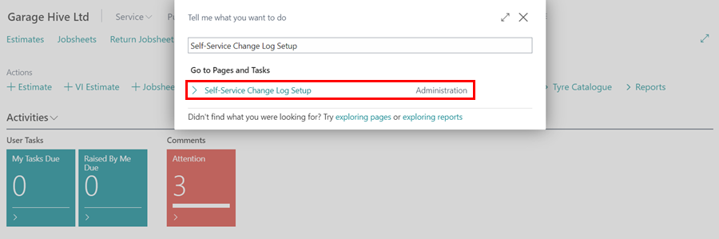

# How to Set Up Change Log for Service Documents
The Change Log feature is useful for tracking data changes in your Garage Hive database. Use this feature to keep track of when data is inserted, modified, or deleted on specific tables.



1. In the top-right corner, choose the  icon, enter **Self-Service Change Log Setup**, and select the related link.

   

2. Select the **Enable for Service Documents** slider to the right on the setup page that opens.

   

3. This enables the tracking of all fields in the **General** FastTab of the service document, as well as some fields in the service document, such as the **Service Comment Line** and the **Service Lines**.
4. To view the changes made in the fields, enter **Change Log Entries** into the  icon in the top right corner and select the related link.

   