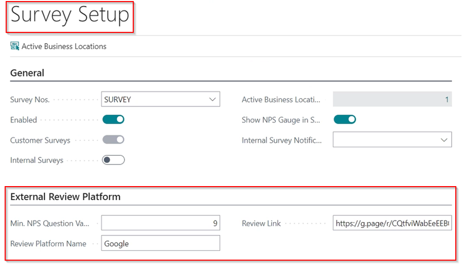

Including an external review follow-up in a customer survey allows the garage to further engage customers who rate the business with a higher NPS score and are satisfied with the services to leave a review on your preferred external platform. At the end, you will increase your rating with better reviews.

## In this article
1. [External Review Follow Up Setup](#External-review-follow-up-setup)
2. [How the External Review Link Appears to the Customer](#tyre-scanner-checklist-template)

### External Review Follow Up Setup
1. In the top right corner, choose the  icon, enter **Customer Notifications**, and select the related link.
2. From the list, choose the **Survey** customer notification. If it is currently enabled, you can disable it first.

   

3. Enter the **Min. NPS Question Value** in the **General** FastTab, under the **External Review Platform** section (if not visible, click **Show more**). If the customer rates the garage with this number or higher, a link to rate the garage appears at the end of the survey.
4. In the **Review Platform Name** field, enter the name of the review platform, such as **Google**, **Trustpilot**, or any other that you use to gain public ratings.
5. Finally, add the **Review Link** for the platform, which will redirect the customer to the review page if they click on it.

   

6. After the setup is complete, enable the **Survey** customer notification.

### How the External Review Link Appears to the Customer
When the **External Review Follow Up Setup** is completed, the customer will have the option of reviewing your business after answering the **Net Promoter Score** survey as follows.

   

