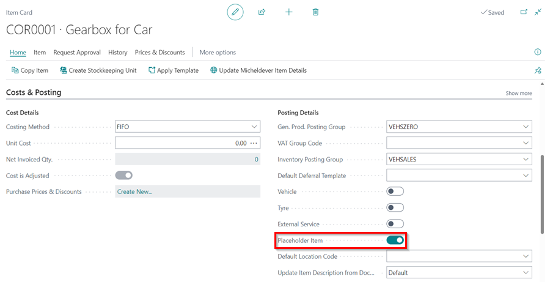
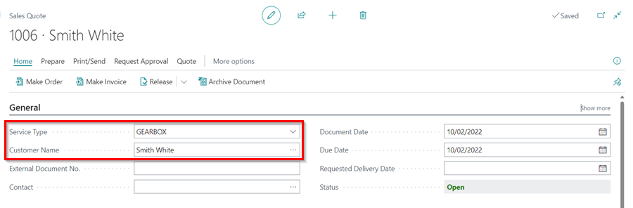
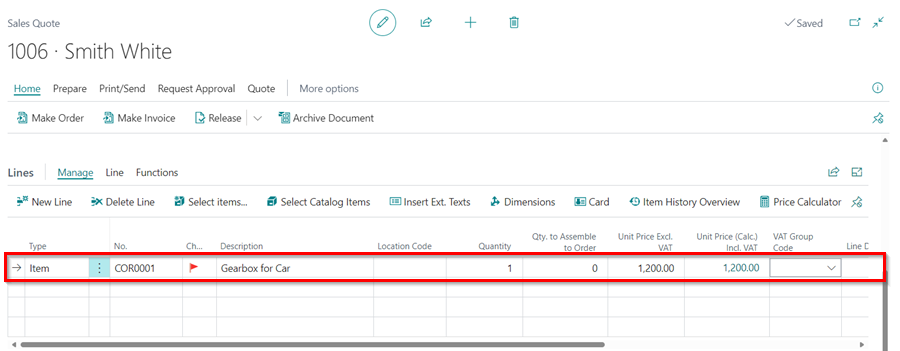
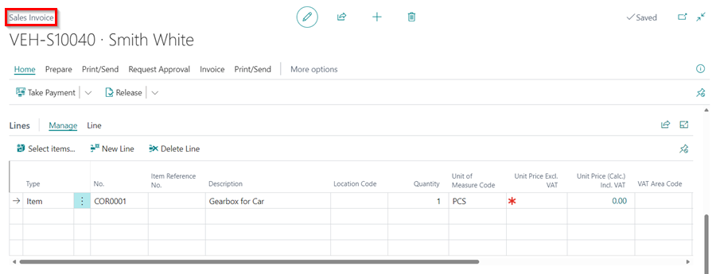
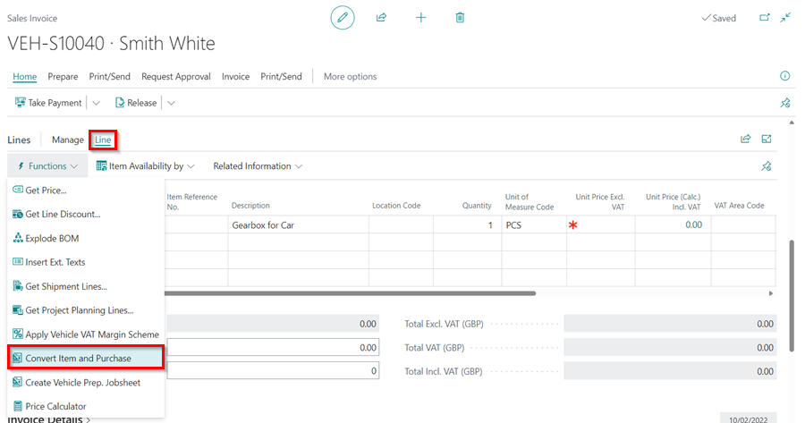
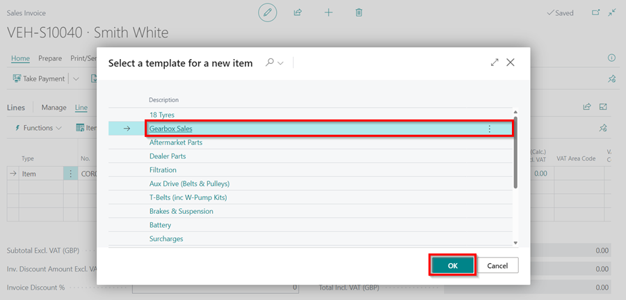
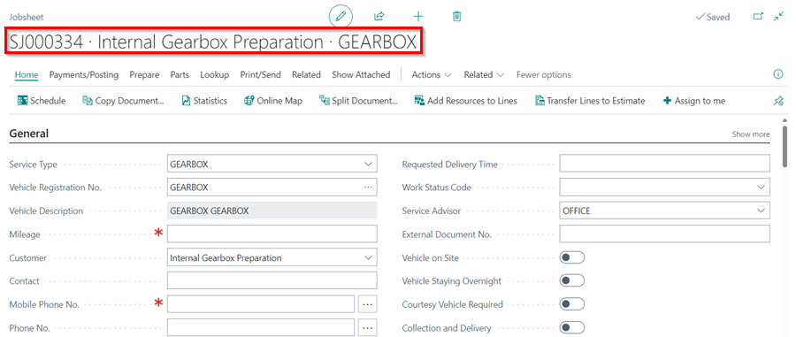

# We are still working on this article!
We are currently reviewing this article before it is published, check back later.

# Tyre Stock Groups
**Tyre Stock Groups** is a feature in Garage Hive where you can conveniently create and manage various tyre groups available in the market, allowing you to effectively organize your tyre inventory based on these groups.

## In this article
1. [Creating Tyre Stock Groups](#creating-tyre-stock-groups)
2. [Create an Item for Pricing up the Gearbox](#create-an-item-for-pricing-up-the-gearbox)
3. [Create a Sales Quote for the Gearbox](#create-a-sales-quote-for-the-gearbox)
4. [Create the Gearbox Item to Sell](#create-the-gearbox-item-to-sell)
5. [Create an Internal Gearbox Preparation Jobsheet](#create-an-internal-gearbox-preparation-jobsheet)

### Duplicate the Vehicle Sales Role
To make it easier to use the **Gearbox Sales Module**, duplicate the **Vehicle Sales Admin** role to create a **Gearbox Sales Admin** role, and then personalise the Role Centre for Gearbox Sales:
1. In the top right corner, choose the  icon, enter **Profiles (Roles)**, and select the related link.

   

2. In the **Profiles (Roles)** page, search for **Vehicle Sales Admin**, click on the ellipsis (...) in the menu bar and select **Copy Profile**.

   

3. Name the new **Profile ID** as **GEARBOXSALES** and the **Display Name** as **Gearbox Sales Admin**. Click **OK**.

   

4. The new profile will now be created. Return to the Role Centre and click the settings gear icon in the top right corner, then **My Settings**, then the three dots next to the **Role** field, followed by **Gearbox Sales Admin**. Click **OK**.

   

[Go back to top](#top)

### Create an Item for Pricing up the Gearbox
The next step is to create a **Placeholder Item** to use when pricing up the Gearbox for sale:
1. Open the Item Lists, select **New**, enter the **Item No.** as **COR0001**, **Description** as **Gearbox for Car**, and the **Item Category Code** as **GEARBOXES**.

   

2. Select the **Placeholder Item** slider under **Costs and Posting** FastTab so that the item cannot be sold. The goal of creating this item is to help in pricing and quoting the Gearbox.

   

3. When you're finished, close the **Item Card**.

[Go back to top](#top)

### Create a Sales Quote for the Gearbox
To quote the customer, you now need to create a **Sales Quote**:
1. In the top right corner, choose the  icon, enter **Sales Quote**, and select the related link.

   

2. Click **New** to create a **Sales Quote**. Select **Service Type** as **Gearbox** and enter **Customer Name**.

   

3. Scroll down to the **Lines** FastTab, select the item you created, and enter the **Unit Price** you want to sell the Gearbox for.

   

4. After sending the **Sales Quote** to the Customer and receiving their approval, convert the **Sales Quote** to an invoice. Select **Process** and then **Make Invoice**.

   

5. The new **Sales Invoice** will be created for the Gearbox item.

   

[Go back to top](#top)

### Create the Gearbox Item to Sell
To create the Gearbox item for selling:
1. Scroll down to the **Lines** FastTab in the **Sales Invoice** you created, then select **Line** from the Lines Menu bar, followed by **Functions**, and then **Convert Item and Purchase**.

   

2. Select **Gearbox Sales** as the template for the new item, and click **OK**. This creates a new **Item** and a **Purchase Order** for the new item.

   

3. The **Placeholder Item** is removed and replaced in the **Sales Invoice** by the new item to sell. The new item appends a string of numbers to the end of the **Placeholder's Item** number.

   

[Go back to top](#top)

### Create an Internal Gearbox Preparation Jobsheet
The next step is to create a **Preparation Jobsheet** on which all the items that will be used to rebuild the Gearbox will be added:
1. In the **Sales Invoice** with the Gearbox item to sell, scroll down to the **Lines** FastTab, then select **Line** from the Lines Menu bar, followed by **Functions**, and then **Create Vehicle Prep. Jobsheet**.

   

2. This creates an **Internal Gearbox Preparation** Jobsheet, where all the items used to rebuild the Gearbox are added.

   

3. Add all the items that are used to rebuild the Gearbox in this Jobsheet.

   

4. Add the **Payment Method Code** as **GEARBOXPRP** under the **Invoicing** FastTab, so that you can use it to fully pay the Jobsheet.

   

5. Then post the Jobsheet once all of the **Items** are added.

   

6. When you post the Jobsheet, the value of the Jobsheet is added to the Gearbox item to sell.

[Go back to top](#top)