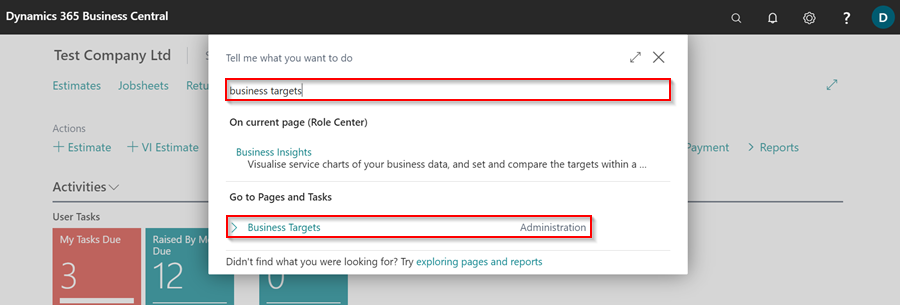
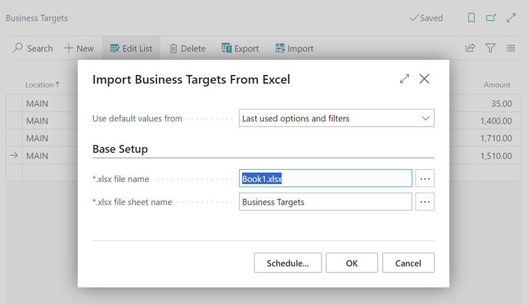
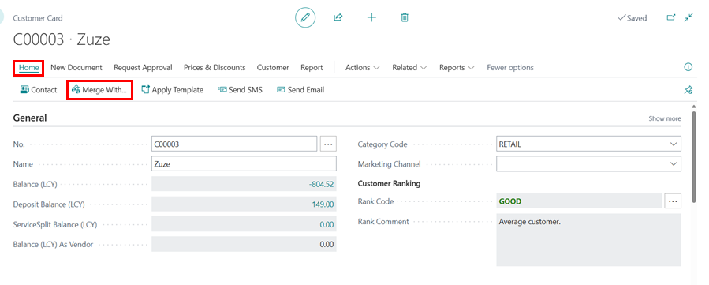
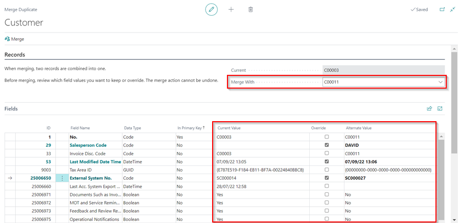
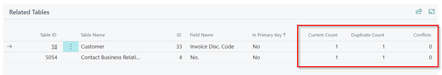
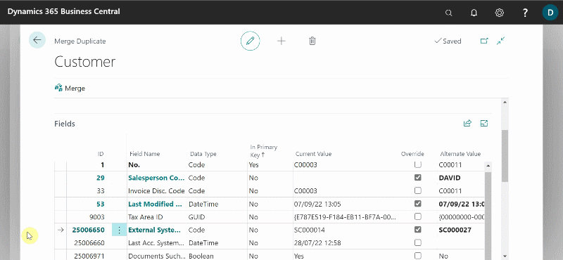

## How to Set Business Targets in Garage Hive
**Business Targets**, such as **Gross Profits**, assist the company in keeping track of the company's performance, ensuring continuous improvements, and always knowing how the company's progress is fairing at all times. Here's how to set **Business Targets:**
1. In the top right corner  icon, enter **Business Targets** and select the related link.

   

2. To set the targets, select the **Location** code, then the **Type** as **Gross Profit**, followed by the **Date** and **Week Day**, which can be the first day of the week, today's date, or any other date as you will get to fill all the days in a calendar year.
3. Now, enter the **Amount** that you want to be your daily target.
4. Select **Export** from the actions bar after selecting all of the fields in the first line. The goal of exporting at this point is to make it easier to enter all of the other days in a year from an excel sheet.
5. In the pop-up window, select **Location** as entered on the first line, and **Type** as **Gross Profit**. Click **OK**.

   

   

6. This now exports the first line as an excel file. Open it and enter all of the **365** days in a year from the excel sheet. Edit the amounts for days where you want the targets to be different, such as Saturdays and Sundays.

   

7. When completed, save the excel sheet and open Garage Hive, then select **Import** on the **Business Targets** page to import the excel sheet that you just edited.
8. Choose the excel file in the ***.xlsxfile name** field, and click **OK**.

   

   

9.  All of the days you added will be imported, and you will have finished setting the business targets in your system.

   

10. If you need to edit the file in bulk, you can just **Export** it, edit and then **Import** otherwise, you can just edit single lines from the **Business Targets** page.

As different users create new customer, vendor, or contact cards over time, or as new records are created automatically during migration, a customer, vendor, or contact cards may be represented in the system by more than one record. In this case, you can use the **Merge Duplicate** page from the card of the record that you want to keep.
The following procedure is based on a customer card. The steps are similar for a vendor and contact cards:
1. Select the **Customers** list, and then choose the customer record that you want to keep.
2. Select **Actions** from the actions bar (if not visible click on **More Options**), then select **Functions** followed by **Merge With**.

   

3. On the **Merge Duplicate** page, in the **Merge With** field, under the **Records** FastTab, select the customer you believe is a duplicate or the one you want to replace with the one you have opened.
4. The **Fields** FastTab lists fields where the values for the two customers differ. This means that if the selected customer, for example, is a duplicate, only a few fields, such as typing errors and other data entry mistakes, should be listed.
5. The values of the fields in the customer record that you have opened are listed in the **Current Value** column, and the values of the fields in the customer card that you have selected are listed in the **Alternate Value** column if they differ from the **Current Value** column.
6. Select the **Override** check box (between the **Current Value** and **Alternate Value** columns) for each field where you want to use a different value than the current one. When you complete the process, the value in the **Alternate Value** column will be transferred to the current record.

   

7. The **Related Tables** FastTab (which is only an informational section) lists tables with fields that are related to both customers. The **Current Count** and **Duplicate Count** columns show the number of fields in related tables that use the **No.** value of both the current and duplicate customer.
8. If conflicts exist, they will be shown in the **Conflicts** column.

   

9.  When you have finished selecting which values to keep or override, choose the **Merge** action from the actions bar. Select **Yes** in the pop-up notification message. This step cannot be undone.

   

### How to Merge Duplicate Records with Conflicts
1. If conflicts exist, choose the **Resolve (xx) conflicts before merge** action on the **Conflicts** FastTab, which will appear if conflicts exist.
2. On the **Merge Duplicate Conflicts** page, select the line for a related table with a conflict, and then choose the **View Details** action.
3. If you do not want to keep the duplicate customer record, choose the **Remove Duplicate** action, and then choose the **Close** button. Identical field values, other than the value in the **No.** field, are removed from the duplicate record and inserted on the current record.
4. If you want to keep the duplicate customer record after the merge, choose the **Rename Duplicate** action.
5. On lines, not for the **No.** field, where the field has the same value on both records, change the value in the **Alternate Value** column, and then choose the **Close** button.
6. Repeat steps **1 through 4** until all conflicts are resolved. The **Conflicts** FastTab disappears.
7. On the **Merge Duplicate** page, choose the **Merge** action again, and then select **Yes** in the pop-up notification message.

