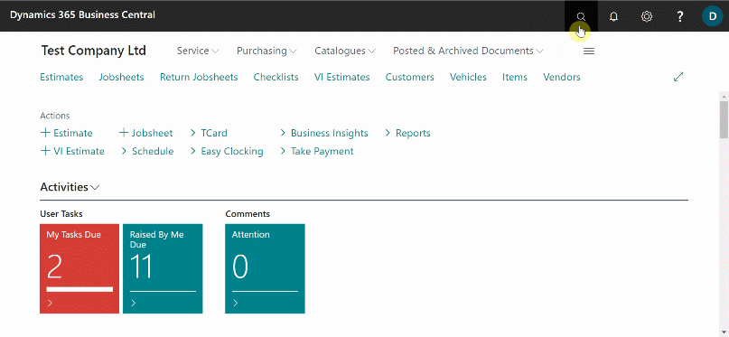

# We are still working on this article!
We are currently reviewing this article before it is published, check back later.

# TScan Trial
This article provides a guide for new TScan customers who want to experience the functionality of Tyre Scanner within their Garage Hive system.

## In this article
1. [Registration for the Trial](#registration-for-the-trial)
2. [Tyre Scanner Trial System Setup](#parent-page-example)
3. [Import Checklist Template](#import-checklist-template)

### Registration for the Trial
1. To register for a trial, click on the registration form link below and follow the instructions.

   > # Tyre Scanner trial registration: <ins>[tSCAN Trial Account Information](){:target="_blank"}</ins>

2. Enter the necessary information required for the creation and setup of your trial customer account.
3. To obtain the **Endpoint URL**, which is required in the form, select the  icon, enter **Tyre Scan Setup**, and select the related link.
4. In the **Tyre Scan Setup** page, click **Get Endpoint Url** and copy the URL from the pop-up notification.

     

5.  When you've finished filling out the form, click **Submit** and wait to hear back from the **tScan** team.

[Go back to top](#top)

### Tyre Scanner Trial System Setup
To connect the **Tyre Scanner** to the system:
1. In the top right corner, choose the  icon, enter **Tyre Scan Setup**, and select the related link.
2. Create a new text template code to be used in the Checklists in the field **Alignment Text Template Code**. 
3. Click **New** at the bottom left of the drop-down list, enter the **Code** as **ALIGNMENT**, and enter the **Text** that will inform the customer about the report, such as "*Based on tyre thread depth scans, we recommend performing wheel alignment.*".
4. Select the **Align** service package in the **Service Package Filter** column to use when quoting for the alignment. When completed, click **OK**.
5. Then, to enable the Tyre Scan in the system, slide the **Enable** slider to the right.

   

[Go back to top](#top)

### Import Checklist Template
The next step is to import a checklist template for use with the Tyre Scanner:
1. Click on the link below to download and save the checklist for use with the Tyre Scanner.

   > # Download the Tyre Scanner Checklist Template: <ins>[Checklist Template](Package.cltx){:target="_blank"}</ins>

2. In the top right corner, choose the  icon, enter **Checklist Templates**, and select the related link.

   

3. In the **Checklist Templates** page, select **Import** from the menu bar.
   
   

4. Select **Choose**, and go to the file that you downloaded and click **Open**.

   

5. You will get the following warning, click **Yes** to import the checklist template.

   

6. Your Garage Hive system is now ready for the trial with Tyre Scanner.

[Go back to top](#top)