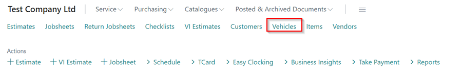
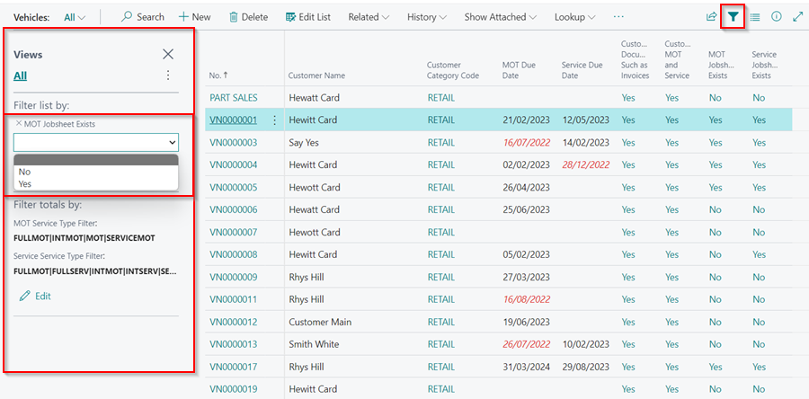
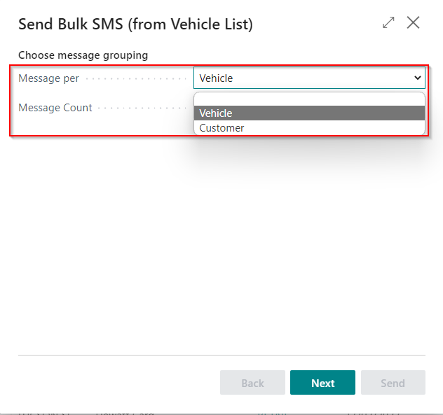
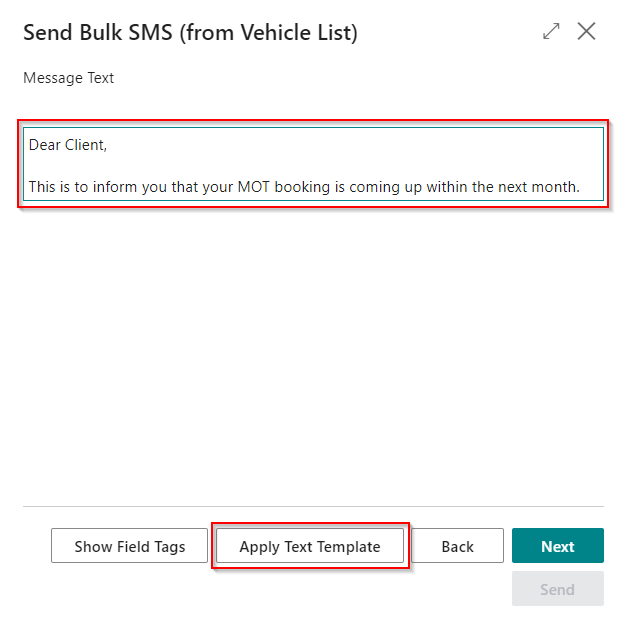
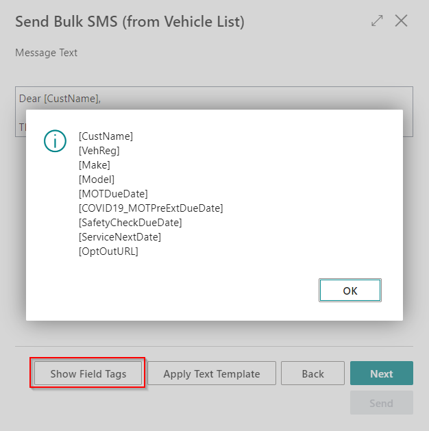
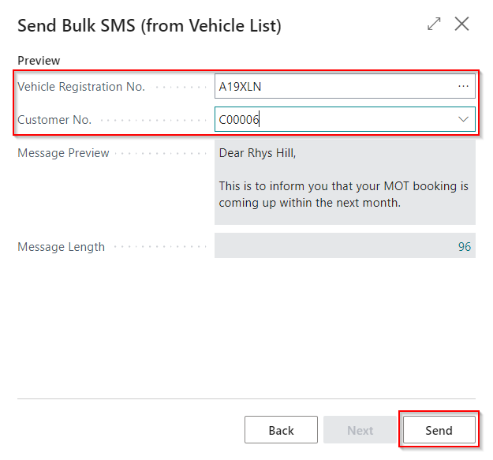

## How to Send Bulk SMS in Garage Hive
1. Open the vehicle list by selecting **Vehicles** from the Role Centre.

   

2. You can filter the vehicle list to show only vehicles for customers to whom you want to send SMS messages; in this case, we can use the **MOT Jobsheet Exists** column to do so. Click the filter icon to display the **Filter Pane**, then select **Filter** and select **MOT Jobsheet Exists**, which has a **Yes** or **No** option.

   

3. After filtering the list, go to the menu bar and select **Actions**, then **Send Bulk SMS**.

   

4. Select whether you want to send SMS messages per vehicle or per customer in the **Message Per** field on the pop-up page, then click **Next**.

   

5. On the following page, you can type your message in the **Message Text** field or use a template by clicking the **Apply Text Template** action.

   

6. You can also use **Field Tags** in the SMS message to refer to the customer's exact details as saved in the system. To see the available field tags, click the **Show Field Tags** action at the bottom. When you're done, click **Next**.
   
   

7. The following page allows you to preview your message before sending it. Choose a **Vehicle Registration No.** and a **Customer No.** as a preview. When you're satisfied with the message, click **Send** to send the messages.

   