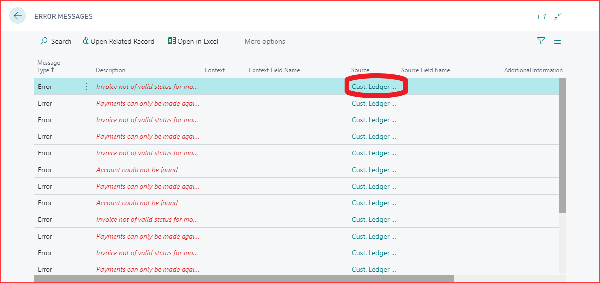
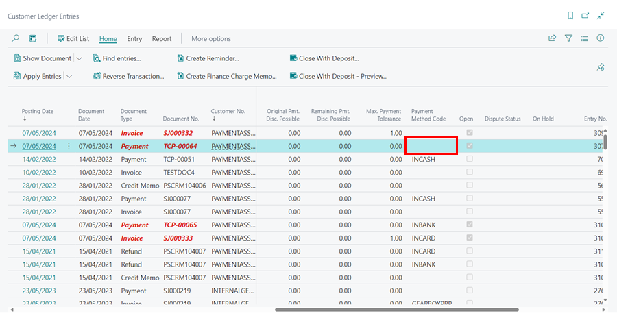
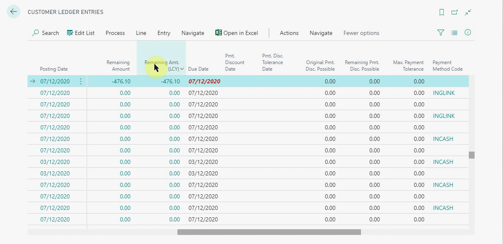
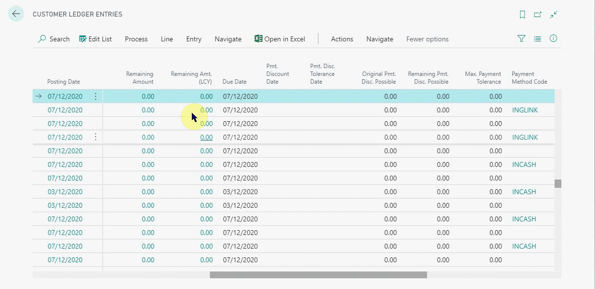
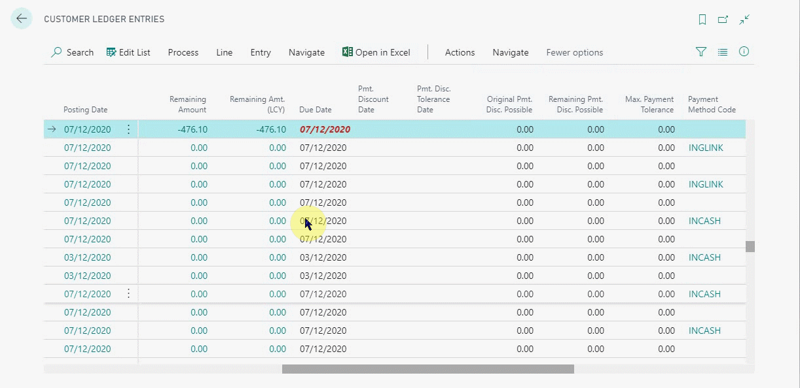
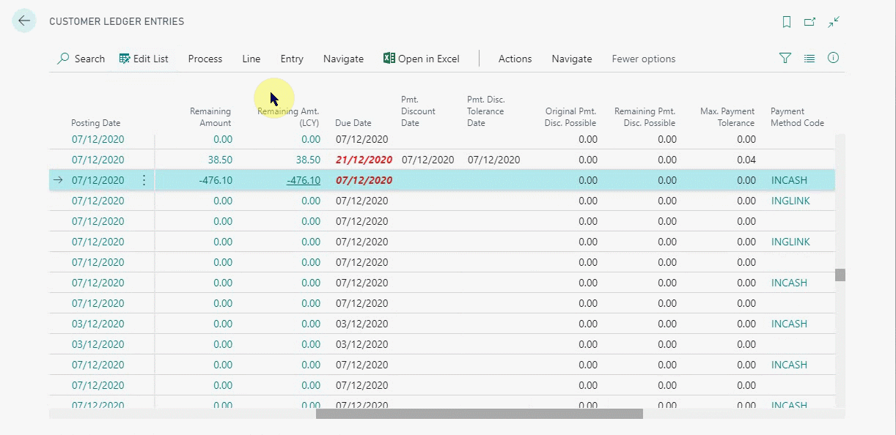

#   Account could not be found. 

This error is most commonly seen when a payment was made in Garage Hive without a Payment Method code and means there is a problem with your setup as it should not be possible to do this, please contact support. 

To see what document this error relates to clicking on the “Source” code to the right of the error and the customer ledger entries page will load with the effected document highlighted.

---

---
Look for the Payment Method Code column and you will see that the code is blank.

---

--- 

To rectify this either make the payment in Xero and skip the payment in Garage Hive by selecting more options > functions > incoming document > external accountancy > mark as skipped. 
Or check how the payment was made.

---

---

Then Un-Apply the entry so that it can be edited, remember to note the document that this entry was applied to.

---

Now edit the list and enter the correct payment method code. 

---

---

Finally re-apply the entry before running the export to xero again.

---

---
