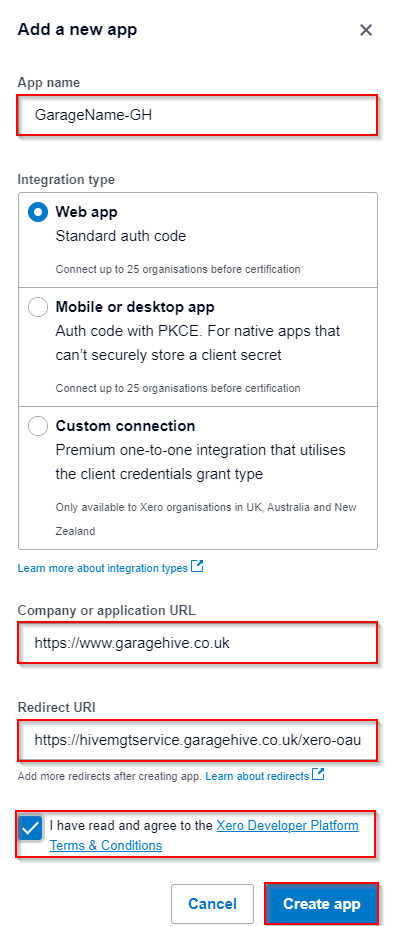
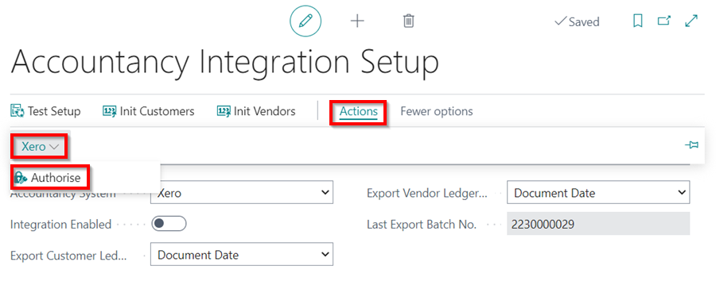

## In this article
1. [What you can export via the Xero API](#what-you-can-export-via-the-xero-api)
2. [Initial Setup](#initial-setup)
3. [How to run the export](#how-to-run-the-export)

### What you can export via the Xero API

Garage Hive allows you to export your data to Xero via an API. You can export the following:

* Customer Invoices
* Customer Credit Memos
* Customer Payments
* Customer Refunds
* Vendor Invoices
* Vendor Credit memos



### Initial Setup
1. In the top right corner, choose the  icon, enter **Accountancy Integration Setup**, and select the related link.

   

1. Select **Xero** as the **Accountancy System** in the **General** FastTab.
1. Specify whether the data should be exported using the posting date or the document date in the **Export Customer Ledger by** and **Export Vendor Ledger by** fields. The most commonly used approach is by **Document Date**. Garage Hive users are often limited to only posting within the current date, therefore the posting date may differ from the date on the invoice from the supplier, whereas the document date would match.

   

1. Scroll down to the **Xero** FastTab. In the **Xero Sales Document Status** and **Xero Purchase Document Status** fields, specify the status of the documents when they are exported to Xero. The options are **Draft**, **Submitted**, or **Authorised**. You can select a different option for Sales and Purchase documents.

   

    

1. To get started with the integration, you'll need to create an "app" in Xero. Sign in with your Xero credentials at [this link](https://developer.xero.com/myapps/){:target="_blank"}. Now, in the middle or top right of the screen, choose **New App**.
1. Name the App; It should be unique, thus we recommend using **GarageName-GH**, but it may be anything. Fill up the details shown below and **Create The App**.
   * **Company or Application URL** - https://www.garagehive.co.uk
   * **OAuth 2.0 redirect URI** - https://hivemgtservice.garagehive.co.uk/xero-oauth2/callback

     

1. Once created, copy the client id and paste it into Garage Hive in the **Xero Client Id** field under **Xero** FastTab.
1. Then choose Generate secret, copy it, and enter it into Garage Hive in the **Xero Client Secret** field.
1. Select **Save** in Xero.

     

1. Now, under Garage Hive's **Accountancy Integration Setup**, from the actions bar, choose **Actions**, then **Xero**, and lastly **Authorise**.

     

1. You will be redirected to a **Xero Website** where you will be prompted to select the correct company and update the connection details.

     

1. Select **Allow** access, and a successful integration will be confirmed.

     

### How to run the export 
1. In the top right corner, choose the  icon, enter **Export to Accountancy System**, and select the related link.

    

2. Select the following options:
   * **Export Customer Invoices/Credit Memos** - This will export all Customer invoices/credit memos for the given date range. 
   * **Export Customer Payments/Refunds** - This will export Invoice payments/refunds as well as payments to accounts within the specified date range.
   * **Export Vendor Invoices/Credit Memos** - This will export all posted purchase orders/purchase invoices as well as posted purchase return orders/purchase credit memos within the given date range.
   * **Export Type** - All or New. You may either export **All** of the documents within the date range or only the **New** documents. Selecting **New** will exclude any previously exported documents. This implies that it is **important** that you keep all prior exported files secure since they will never be reproduced. When using **New**, a transaction that has already been exported will be flagged and will not be exported again.
   * **Date From** and **Date To** - Choose your date range.

3. Under Catalogs:
   * **Export All Customers** - This will generate an export of all customers in the system.
   * **Export All Vendors** - This will generate an export of all vendors in the system.



 

### **See Also**

[Video: Xero Integration in Garage Hive](https://www.youtube.com/watch?v=WhGdR_xz9xo) \
[How to Integrate Garage Hive With Your External Accountancy System](garagehive-external-accountancy-integration.html) \
[How to Export to Your External Accountancy System](garagehive-finance-accountancy-export.html) \
[How to Import Your Exported Data Into Sage 50 Accounts](garagehive-import-exported-data-to-sage-50-accounts.html)
