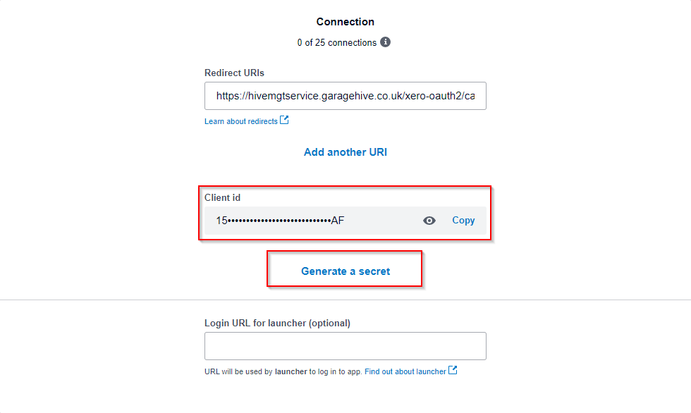
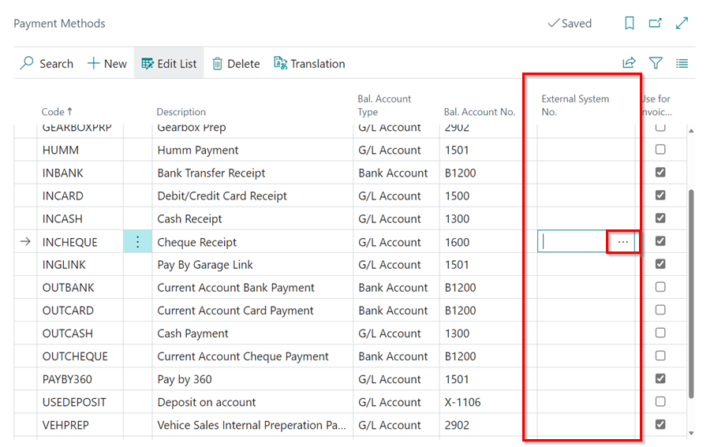
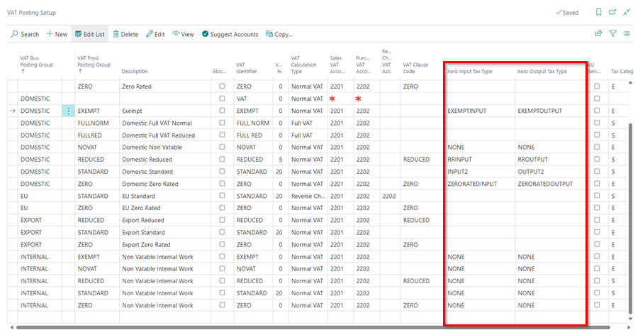
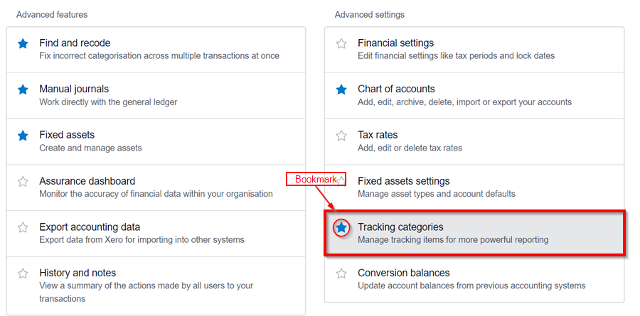

## In this article
1. [What you can export via the Xero API](#what-you-can-export-via-the-xero-api)
2. [Initial Setup](#initial-setup)
3. [Integrate Chart of Accounts](#integrate-chart-of-accounts)
3. [Integrate Payment Methods](#integrate-payment-methods)
4. [Integrate VAT Posting](#integrate-vat-posting)
5. [How to run the export](#how-to-run-the-export)
6. [Adding Tracking Categories in Xero](#adding-tracking-categories-in-xero)

### What you can export via the Xero API

Garage Hive allows you to export your data to Xero via an API. You can export the following:

* Customer Invoices
* Customer Credit Memos
* Customer Payments
* Customer Refunds
* Vendor Invoices
* Vendor Credit memos



[Go back to top](#top)

### Initial Setup
1. In the top right corner, choose the  icon, enter **Accountancy Integration Setup**, and select the related link.

   

1. Select **Xero** as the **Accountancy System** in the **General** FastTab.
1. Specify whether the data should be exported using the posting date or the document date in the **Export Customer Ledger by** and **Export Vendor Ledger by** fields. The most commonly used approach is by **Document Date**. Garage Hive users are often limited to only posting within the current date, therefore the posting date may differ from the date on the invoice from the supplier, whereas the document date would match.

   

1. Scroll down to the **Xero** FastTab. In the **Xero Sales Document Status** and **Xero Purchase Document Status** fields, specify the status of the documents when they are exported to Xero. The options are **Draft**, **Submitted**, or **Authorised**. You can select a different option for Sales and Purchase documents.

   

    

1. Select the **Integration Enabled** slider to enable the integration.

   

1. To get started with the integration, you'll need to create an "**App**" in Xero. Sign in with your Xero credentials at [**this link**](https://developer.xero.com/myapps/){:target="_blank"}. Now, in the middle or top right of the screen, choose **New App**.
1. Name the App; It should be unique, thus we recommend using **GarageName-GH**, but it may be any other name that you choose. Fill up the details shown below.
   * **Company or Application URL** - https://www.garagehive.co.uk
   * **Redirect URL** - https://hivemgtservice.garagehive.co.uk/xero-oauth2/callback

1. Select the **Terms & Conditions** checkbox and then click **Create App**.

     

1. In the next page, select **Configuration** on the left hand side.

     

1. Copy the client id and paste it into Garage Hive in the **Xero Client Id** field under **Xero** FastTab.
1. Then choose **Generate a Secret**, copy it, and enter it into Garage Hive in the **Xero Client Secret** field.

     

     

      

1. Now, under Garage Hive's **Accountancy Integration Setup**, from the menu bar, choose **Actions**, then **Xero**, and lastly **Authorise**.

     

1.  You will be redirected to the **Xero Website** and prompted to select **Allow Access** before a successful integration is confirmed.

     

     

[Go back to top](#top)

### Integrate Chart of Accounts
To integrate the **Chart of Accounts** to **Xero Accounting** accounting system: 
1. In the top-right corner, choose the  icon, enter **Chart of Accounts** and select the related link.

   

2. In the **Chart of Accounts** page, select **Edit List** from the menu bar.
3. In the **External System No.** column, enter the account number for the accounts you want to integrate with the external system. In this case, we'll integrate all of the **4000s** accounts.

   

   

[Go back to top](#top)

### Integrate Payment Methods
To add the **External System No.** to the **Payments Methods**: 
1. In the top-right corner, choose the  icon, enter **Payment Methods** and select the related link.

   

2. In the **External System No.** column, click on the three dots to select the corresponding code for the **Payment Methods** that you use in your external system.

   

[Go back to top](#top)

### Integrate VAT Posting
To integrate the VAT posting in your system: 
1. In the top-right corner, choose the  icon, enter **VAT Posting Setup** and select the related link.

   

2. In the **External VAT Identifier Code** column, click on the three dots to select the corresponding code for the **VAT Posting** that you use in your external system.

   
   
[Go back to top](#top)

### How to run the export 
1. In the top right corner, choose the  icon, enter **Export to Accountancy System**, and select the related link.

    

2. Select the following options:
   * **Export Customer Invoices/Credit Memos** - This will export all Customer invoices/credit memos for the given date range. 
   * **Export Customer Payments/Refunds** - This will export Invoice payments/refunds as well as payments to accounts within the specified date range.
   * **Export Vendor Invoices/Credit Memos** - This will export all posted purchase orders/purchase invoices as well as posted purchase return orders/purchase credit memos within the given date range.
   * **Export Type** - All or New. You may either export **All** of the documents within the date range or only the **New** documents. Selecting **New** will exclude any previously exported documents. This implies that it is **important** that you keep all prior exported files secure since they will never be reproduced. When using **New**, a transaction that has already been exported will be flagged and will not be exported again.
   * **Date From** and **Date To** - Choose your date range.

3. Under Catalogs:
   * **Export All Customers** - This will generate an export of all customers in the system.
   * **Export All Vendors** - This will generate an export of all vendors in the system.



[Go back to top](#top)

### Adding Tracking Categories in Xero
1. To add **Tracking Category** such as **Branch** in Xero, choose the  icon, enter **Dimensions**, and select the related link.
2. Select the row with the **Branch** dimension and then select **Dimension** from the menu bar, followed by **Dimension Values**.

    

3. Add the column **External Dimension Value Code** to the page that appears by using Garage Hive's [personalising feature](garagehive-personalising-garagehive.html#adding-fields-to-pages){:target="_blank"}.
4. Enter the values in this column to match the **Code** for the branch, then exit the page.

    
    
    

5. Choose the  icon, enter **Accountancy Integration Setup**, and select the related link.
6. Scroll down to **Xero** FastTab, and in the **Department Dimension Code** field, enter **Branch**.

    

7. Now, log in to your Xero account and select **Accounting** from the top menu, followed by **Advanced**.

    

8. Select **Tracking Categories** from the page that appears, then bookmark it by selecting the star on the left. By bookmarking it, it will appear under **Advanced** in the **Accounting** main menu.

    

9.  Select **Add Tracking Category** on the **Tracking Categories** page and name it the same as the **Department Dimension Code** (case sensitive) as in Garage Hive. Then, add the **Category Options**, same as the various branches of your business (case sensitive).

    

10. The **Tracking Categories** will be added successfully, and you may now [run the export](#how-to-run-the-export) as described above.

[Go back to top](#top)

 

### **See Also**

[Accounting System Integrations](garagehive-external-accountancy-integration.html){:target="_blank"} \
[Video: Xero Integration in Garage Hive](https://www.youtube.com/watch?v=WhGdR_xz9xo){:target="_blank"} \
[How to Export to Your External Accountancy System](garagehive-finance-accountancy-export.html){:target="_blank"} \
[How to Import Your Exported Data Into Sage 50 Accounts](garagehive-import-exported-data-to-sage-50-accounts.html){:target="_blank"}
