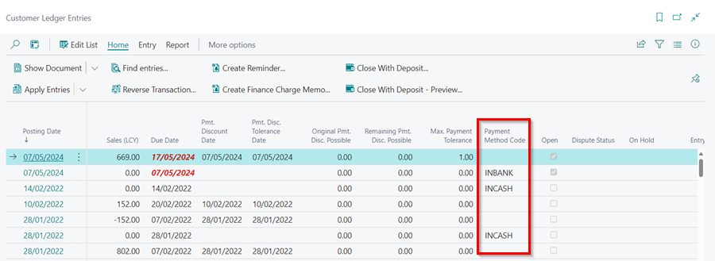
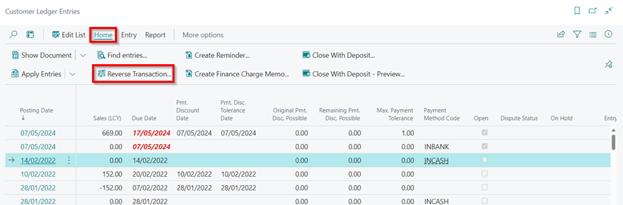
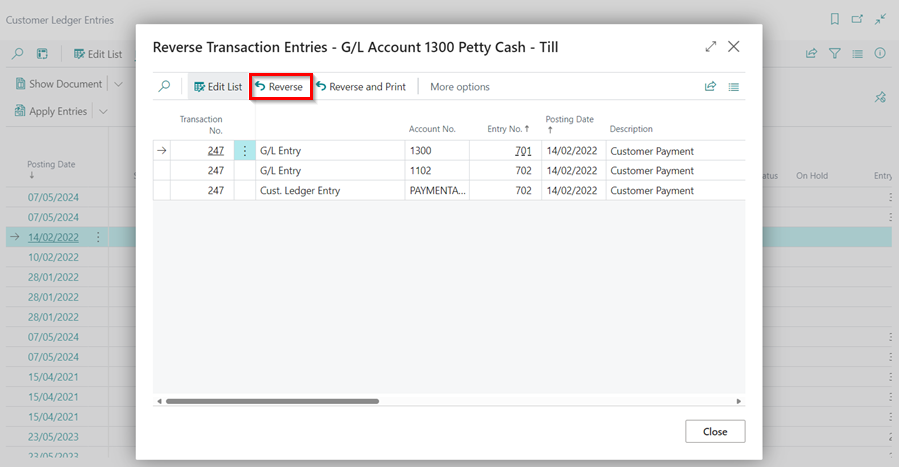
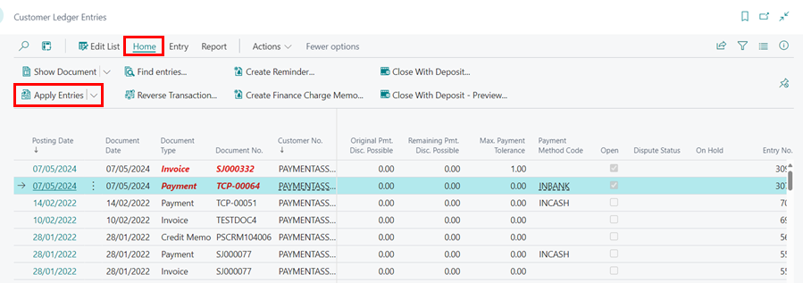

## Common Errors Found after Exporting to Xero 
This article lists some common errors that are found after exporting to Xero:

1. [Payment is applied to more than one document&#46;](#payment-is-applied-to-more-than-one-document)
2. [Payments can only be made against authorised documents&#46; The payment amount exceeds the amount outstanding on this document&#46;](#payments-can-only-be-made-against-authorised-documents-the-payment-amount-exceeds-the-amount-outstanding-on-this-document)
3. [Invoice not of valid status for modification&#46; This document cannot be edited as it has a payment or credit note allocated to it&#46;](#invoice-not-of-valid-status-for-modification-this-document-cannot-be-edited-as-it-has-a-payment-or-credit-note-allocated-to-it)
4. [Account could not be found&#46;](#account-could-not-be-found)
5. [Email address must be valid.](#email-address-must-be-valid)
6. [Another contact has this contact number&#46; Please enter a different contact number&#46;](#another-contact-has-this-contact-number-please-enter-a-different-contact-number)
7. [This payment is not applied&#46;](#this-payment-is-not-applied)

#### Payment is applied to more than one document.
This error is most typically seen when the lump payment feature is used. This feature does not work with Xero.

The full description of the error will appear if you hover your mouse pointer over the red text of the error.

   

1. Click on the blue text in the **Source** column to the right of the error to open the customer ledger entries and highlight the offending entry.
2. Scroll to the right and note how this payment was made in the **Payment Method Code** column.

   

3. From the menu bar, choose **Home**, then  select the **Unapply Entries** option from the **Apply Entries** split button dropdown menu.

   

3. Make a note of the multiple entries that were applied on the page that opens, and then select **Unapply** from the menu bar to unapply the entries.

   

4. Return to the **Customer Ledger Entries** page, choose **Home**, and then **Reverse Transaction** from the menu bar.

   

5. Select **Reverse** on the next page. 

   

6. From the Role Centre, select the **Take Payment** action to allocate the payments again.

   

7. Enter the **Customer Name** and the **Payment Method Code**. Click **Next**. 

   

8. Select the **Amount** field, to allocate the payment to the documents. Click **Next**.

   

9. Post the **Payment**.

   

[Go back to top](#top)

#### Payments can only be made against authorised documents. The payment amount exceeds the amount outstanding on this document.
This error is most commonly seen when an invoice is manually paid in Xero instead of allowing GH to pay the invoice via the integration. 

To see what document this error relates to clicking on the “Source” code to the right of the error and the customer ledger entries page will load with the effected document highlighted. 

   

To resolve this issue, you can either un-apply the payment in Xero and re-export it from Garage Hive, or navigate to the **Customer Ledger Entries** page, select **More Options**, then choose **Actions**, followed by **Functions**, then **Incoming Document**, then **External Accountancy** and finally, **Mark as Skipped**.

   

[Go back to top](#top)

#### Invoice not of valid status for modification. This document cannot be edited as it has a payment or credit note allocated to it.
This error is most commonly seen when an invoice is manually created Xero instead of allowing GH to create the invoice via the integration. 

To see what document this error relates to clicking on the “Source” code to the right of the error and the customer ledger entries page will load with the effected document highlighted. 

   

To resolve this issue, you can either remove the invoice from Xero and re-export the invoice from Garage Hive or navigate to the **Customer Ledger Entries** page, select **More Options**, then choose **Actions**, followed by **Functions**, then **Incoming Document**, then **External Accountancy** and finally, **Mark as Skipped**.

   

[Go back to top](#top)

#### Account could not be found.
This error is most commonly seen when a payment was made in Garage Hive without a Payment Method code and means there is a problem with your setup as it should not be possible to do this, please contact support. 

To see what document this error relates to click on the **Source** code to the right of the error and the customer ledger entries page will load with the affected document highlighted.

   

Look for the Payment Method Code column and you will see that the code is blank.

   

To resolve this issue, either make the payment in Xero and skip the payment in Garage Hive by selecting **More Options**, then choose **Actions**, followed by **Functions**, then **Incoming Document**, then **External Accountancy** and finally, **Mark as Skipped**.

   

Or check how the payment was made.

   

Next, un-apply the entry so that it can be edited. Select **Home** from the menu bar, followed by the **Unapply Entries** option from the split button dropdown menu under **Apply Entries**. Make sure to take note of the document to which the entry was previously applied.

   

Proceed to update the list by entering the correct payment method code. Click on **Edit List** to make it editable. 

   

Once done, re-apply the entry before running the export to Xero again. Select **Home** from the menu bar, followed by the **Apply Entries**.

   

[Go back to top](#top)

#### Email address must be valid.
This error is most commonly seen when the email address in a customer card is not correct . 

To see what document this error relates to clicking on the “Source” code to the right of the error and the customer ledger entries page will load with the effected document highlighted.

   

Select **Entry** from the menu bar, and choose **Customer** to open the customer card and edit the email address. 

   

Once done, you can re-export to Xero.

[Go back to top](#top)

#### Another contact has this contact number. Please enter a different contact number.
This error is most commonly seen when a contact has been merged in Xero whilst there are outstanding documents for that contact, in this instance when Garage Hive tries to interact with the previous entries in Xero it produces an error. 

To see which document is affected by this error, click on the **Source** code to the right of the error, and the customer ledger entries page will open, with the affected document highlighted. 

   

To resolve this issue, make the entry needed manually in **Xero** and mark the entry as skipped in Garage Hive by selecting **More Options**, then choose **Actions**, followed by **Functions**, then **Incoming Document**, then **External Accountancy** and finally, **Mark as Skipped**.

   

Then be sure to block that contact in Garage Hive so it's not used again.

[Go back to top](#top)

#### This payment is not applied.
This error is most commonly seen when a payment has been taken on Garage Hive but has not been applied to a document. 

To see what document this error relates to clicking on the “Source” code to the right of the error and the customer ledger entries page will load with the effected document highlighted. 

   

Apply this payment to an entry and re run the export to Xero.

[Go back to top](#top)
     	 	 