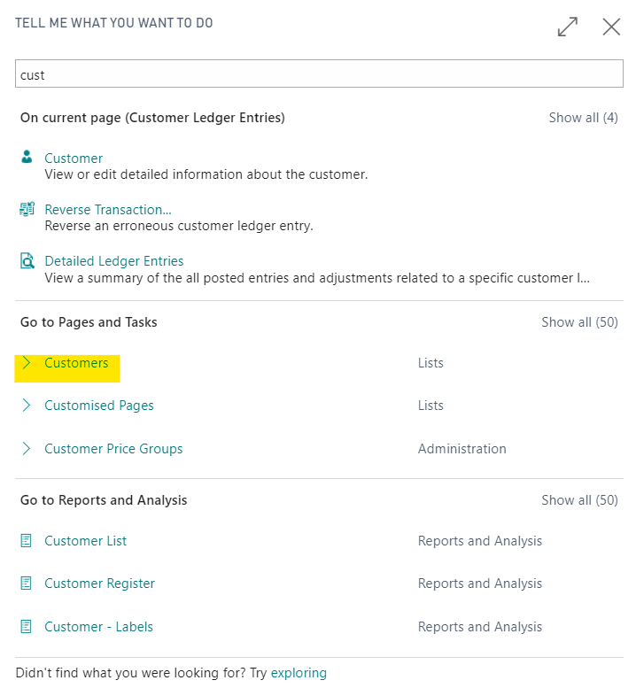
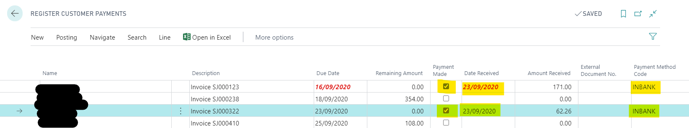
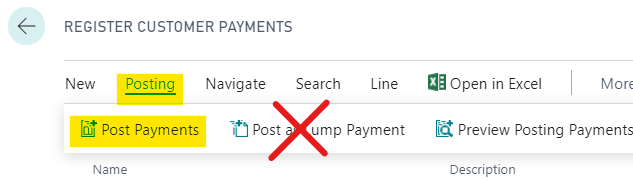

#   Payment is applied to more than one document.  

This error is most commonly seen when the lump payment feature has been used.
N.B this feature is not compatible with Xero.

When you see any error in Garage Hive if you hover over the red text you will get a full description of the error.

---

---

If you click on the blue text under source to the right of the error, it will open the customer ledger entries, and the offending entry will be highlighted.

---

---

Scroll over to the right and take note of how this payment was made under payment method code.

---

---

Then select Process and Unapply entries. 

---

---

Here you will see the multiple entries that where applied, make a note of these for later and unapply the entries.

---

---

Once unapplied, from back in the Customer ledger entries, select process and reverse the transaction. 

---

---

and select reverse on the next page. 

---

---

Now search the magnifying glass for customers and open the customer list. 

---

---

Now use the register customer payments feature to allocate the payments again. 

---

---

Be sure to use post payments, not post lump payments.

---

---