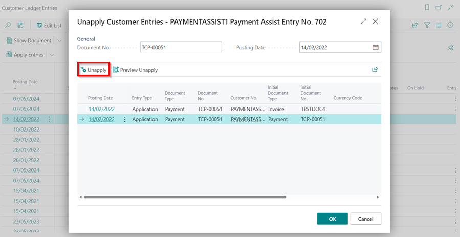
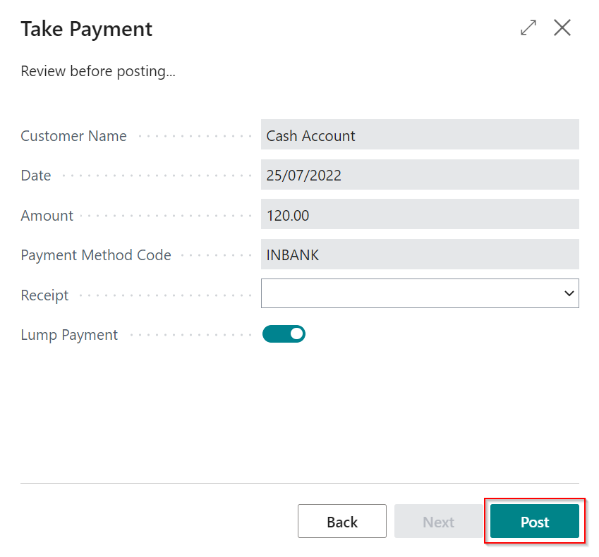

## Payment is applied to more than one document  

This error is most typically seen when the lump payment feature is used. This feature does not work with Xero.

The full description of the error will appear if you hover your mouse pointer over the red text of the error.

---

   

---

1. Click on the blue text in the **Source** column to the right of the error to open the customer ledger entries and highlight the offending entry.
2. Scroll to the right and note how this payment was made in the **Payment Method Code** column.

   

3. From the menu bar, choose **Home**, then  select the **Unapply Entries** option from the **Apply Entries** split button dropdown menu.

   

3. Make a note of the multiple entries that were applied on the page that opens, and then select **Unapply** from the menu bar to unapply the entries.

   

4. Return to the **Customer Ledger Entries** page, choose **Home**, and then **Reverse Transaction** from the menu bar.

   

5. Select **Reverse** on the next page. 

   

6. From the Role Centre, select the **Take Payment** action to allocate the payments again.

   

7. Enter the **Customer Name** and the **Payment Method Code**. Click **Next**. 

   

8. Select the **Amount** field, to allocate the payment to the documents. Click **Next**.

   

9. Post the **Payment**.

   

---