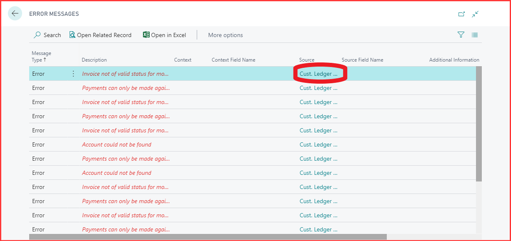

#   Payments can only be made against Authorised documents Payment amount exceeds the amount outstanding on this document.  

This error is most commonly seen when an invoice is manually paid in Xero instead of allowing GH to pay the invoice via the integration. 

To see what document this error relates to clicking on the “Source” code to the right of the error and the customer ledger entries page will load with the effected document highlighted. 

---

---

To rectify this either un-apply the payment in Xero and re-export the payment from Garage Hive or select more options > functions > incoming document > external accountancy > mark as skipped.

---

---